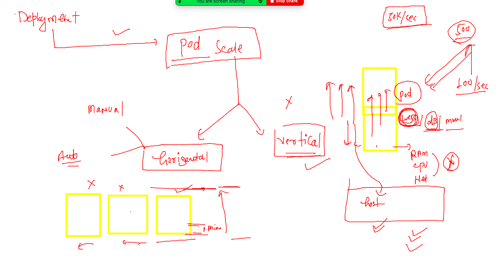
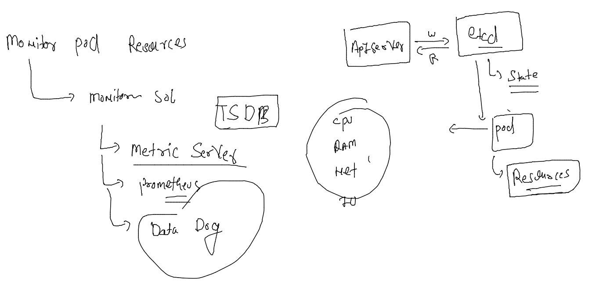
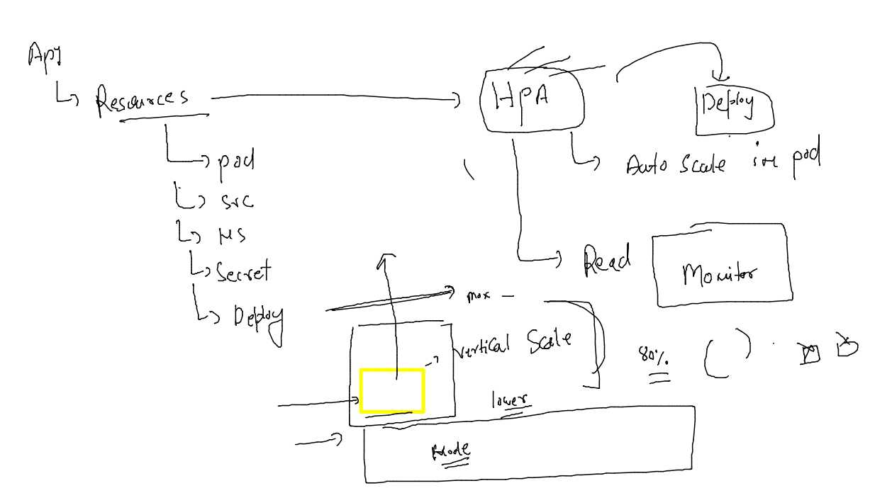
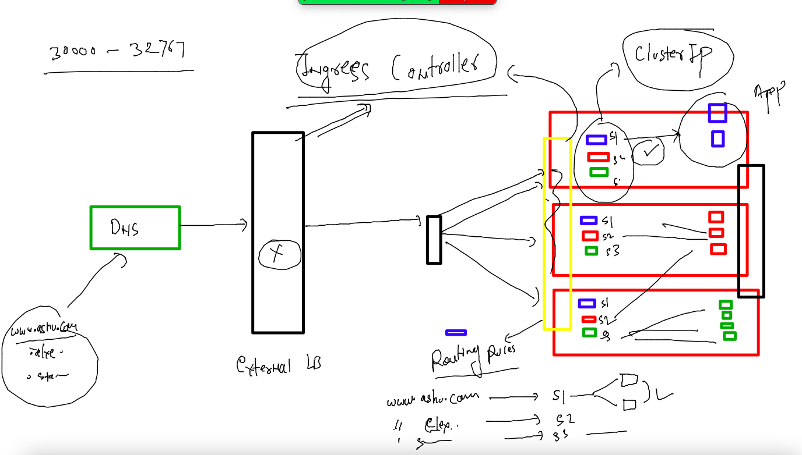
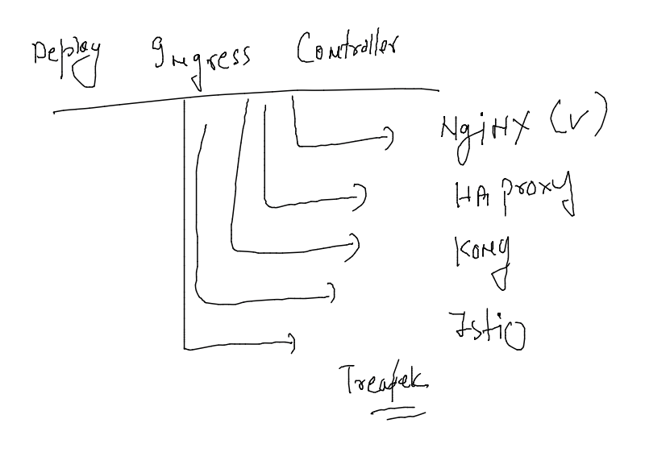

# mobileum_cna_may162022

## Session Plan :-  


## Recreating namespace and setting it as default 

```
kubectl get  ns
NAME              STATUS   AGE
default           Active   20m
kube-node-lease   Active   20m
kube-public       Active   20m
kube-system       Active   20m
[ashu@client-machine ~]$ kubectl create  ns  ashu-space 
namespace/ashu-space created
[ashu@client-machine ~]$ kubectl get ns
NAME              STATUS   AGE
ashu-space        Active   4s
default           Active   20m
kube-node-lease   Active   20m
kube-public       Active   20m
kube-system       Active   20m
[ashu@client-machine ~]$ kubectl get po
No resources found in default namespace.
[ashu@client-machine ~]$ kubectl config set-context --current --namespace=ashu-space
Context "kubernetes-admin@kubernetes" modified.
[ashu@client-machine ~]$ 


```

### checking current namespace 

```
kubectl  config get-contexts 
CURRENT   NAME                          CLUSTER      AUTHINFO           NAMESPACE
*         kubernetes-admin@kubernetes   kubernetes   kubernetes-admin   ashu-space
```

### Understanding problems with POD 


### Intro to controllers in k8s 


### nativ to k8s kube-system namespace 

```
kubectl  get  pods  -n kube-system 
NAME                                       READY   STATUS    RESTARTS   AGE
calico-kube-controllers-56cdb7c587-gt7dh   1/1     Running   0          52m
calico-node-44lpz                          1/1     Running   0          52m
calico-node-9vtdj                          1/1     Running   0          52m
calico-node-fhfz8                          1/1     Running   0          52m
coredns-6d4b75cb6d-fs7hz                   1/1     Running   0          53m
coredns-6d4b75cb6d-xmwlp                   1/1     Running   0          53m
etcd-control-plane                         1/1     Running   0          53m
kube-apiserver-control-plane               1/1     Running   0          53m
kube-controller-manager-control-plane      1/1     Running   0          53m
kube-proxy-28ltf                           1/1     Running   0          52m
kube-proxy-vtz2p                           1/1     Running   0          52m
kube-proxy-z527m                           1/1     Running   0          53m
kube-scheduler-control-plane               1/1     Running   0          53m

```

### deployment Resource type to create POds with features like scaling / recreation 


### 

```
 kubectl create -f  deployment1.yaml 
deployment.apps/ashuapp1 created
[ashu@client-machine ~]$ kubectl  get  deployments 
NAME       READY   UP-TO-DATE   AVAILABLE   AGE
ashuapp1   1/1     1            1           6s
[ashu@client-machine ~]$ kubectl get  po
NAME                        READY   STATUS    RESTARTS   AGE
ashuapp1-569f58ddbb-krrpq   1/1     Running   0          13s
[ashu@client-machine ~]$ 


```

### pod recreation will happen if we / someone delete pod 

```
kubectl create -f  deployment1.yaml 
deployment.apps/ashuapp1 created
[ashu@client-machine ~]$ kubectl  get  deployments 
NAME       READY   UP-TO-DATE   AVAILABLE   AGE
ashuapp1   1/1     1            1           6s
[ashu@client-machine ~]$ kubectl get  po
NAME                        READY   STATUS    RESTARTS   AGE
ashuapp1-569f58ddbb-krrpq   1/1     Running   0          13s
[ashu@client-machine ~]$ kubectl get  po -owide
NAME                        READY   STATUS    RESTARTS   AGE     IP              NODE    NOMINATED NODE   READINESS GATES
ashuapp1-569f58ddbb-krrpq   1/1     Running   0          2m22s   192.168.104.5   node2   <none>           <none>
[ashu@client-machine ~]$ kubectl  delete pod  ashuapp1-569f58ddbb-krrpq
pod "ashuapp1-569f58ddbb-krrpq" deleted
[ashu@client-machine ~]$ kubectl get  po -owide
NAME                        READY   STATUS    RESTARTS   AGE   IP                NODE    NOMINATED NODE   READINESS GATES
ashuapp1-569f58ddbb-nb7rq   1/1     Running   0          3s    192.168.166.140   node1   <none>           <none>
[ashu@client-machine ~]$ 


```

### pod scaling understanding 



### manual scaling of pod using deployment 

```
kubectl get  deploy 
NAME       READY   UP-TO-DATE   AVAILABLE   AGE
ashuapp1   1/1     1            1           15m
[ashu@client-machine ~]$ kubectl get  po
NAME                        READY   STATUS    RESTARTS   AGE
ashuapp1-569f58ddbb-nb7rq   1/1     Running   0          12m
[ashu@client-machine ~]$ 
[ashu@client-machine ~]$ kubectl scale  deploy  ashuapp1  --replicas=3
deployment.apps/ashuapp1 scaled
[ashu@client-machine ~]$ =
-bash: =: command not found
[ashu@client-machine ~]$ kubectl get  deploy 
NAME       READY   UP-TO-DATE   AVAILABLE   AGE
ashuapp1   3/3     3            3           15m
[ashu@client-machine ~]$ kubectl get  po 
NAME                        READY   STATUS    RESTARTS   AGE
ashuapp1-569f58ddbb-8mm65   1/1     Running   0          23s
ashuapp1-569f58ddbb-ch4zq   1/1     Running   0          23s
ashuapp1-569f58ddbb-nb7rq   1/1     Running   0          13m
[ashu@client-machine ~]$ kubectl get  po  -owide
NAME                        READY   STATUS    RESTARTS   AGE   IP                NODE    NOMINATED NODE   READINESS GATES
ashuapp1-569f58ddbb-8mm65   1/1     Running   0          58s   192.168.104.29    node2   <none>           <none>
ashuapp1-569f58ddbb-ch4zq   1/1     Running   0          58s   192.168.104.30    node2   <none>           <none>
ashuapp1-569f58ddbb-nb7rq   1/1     Running   0          13m   192.168.166.140   node1   <none>           <none>
[ashu@client-machine ~]$ 

```

### scaling pod using yaml also 

```
kubectl apply -f deployment1.yaml 
Warning: resource deployments/ashuapp1 is missing the kubectl.kubernetes.io/last-applied-configuration annotation which is required by kubectl apply. kubectl apply should only be used on resources created declaratively by either kubectl create --save-config or kubectl apply. The missing annotation will be patched automatically.
deployment.apps/ashuapp1 configured
[ashu@client-machine ~]$ 
[ashu@client-machine ~]$ 
[ashu@client-machine ~]$ kubectl get  po  -owide
NAME                        READY   STATUS    RESTARTS   AGE     IP                NODE    NOMINATED NODE   READINESS GATES
ashuapp1-569f58ddbb-8mm65   1/1     Running   0          2m14s   192.168.104.29    node2   <none>           <none>
ashuapp1-569f58ddbb-92vfn   1/1     Running   0          6s      192.168.166.158   node1   <none>           <none>
ashuapp1-569f58ddbb-ch4zq   1/1     Running   0          2m14s   192.168.104.30    node2   <none>           <none>
ashuapp1-569f58ddbb-nb7rq   1/1     Running   0          15m     192.168.166.140   node1   <none>           <none>
[ashu@client-machine ~]$ 

```

### creating service using expose command so that pod label will be automatically updated by service selector 

```
kubectl get  deploy
NAME       READY   UP-TO-DATE   AVAILABLE   AGE
ashuapp1   2/2     2            2           86s
[ashu@client-machine ~]$ kubectl  get po 
NAME                        READY   STATUS    RESTARTS   AGE
ashuapp1-59bb8bb5b9-hskbx   1/1     Running   0          89s
ashuapp1-59bb8bb5b9-w6t8g   1/1     Running   0          89s
[ashu@client-machine ~]$ kubectl  get po  --show-labels
NAME                        READY   STATUS    RESTARTS   AGE   LABELS
ashuapp1-59bb8bb5b9-hskbx   1/1     Running   0          92s   app=ashuapp1,pod-template-hash=59bb8bb5b9
ashuapp1-59bb8bb5b9-w6t8g   1/1     Running   0          92s   app=ashuapp1,pod-template-hash=59bb8bb5b9
[ashu@client-machine ~]$ 
[ashu@client-machine ~]$ 
[ashu@client-machine ~]$ kubectl  get  deploy 
NAME       READY   UP-TO-DATE   AVAILABLE   AGE
ashuapp1   2/2     2            2           2m23s
[ashu@client-machine ~]$ kubectl   expose deploy  ashuapp1  --type NodePort  --port 80 --name ashulb1 
service/ashulb1 exposed
[ashu@client-machine ~]$ kubectl get svc 
NAME      TYPE       CLUSTER-IP       EXTERNAL-IP   PORT(S)        AGE
ashulb1   NodePort   10.110.161.223   <none>        80:32228/TCP   4s
[ashu@client-machine ~]$ 

```

## Autoscaling in k8s  need Monitoring solutions 

### Monitoring plugin / tools for k8s



### deploy matric server for pod Monitoring 

```
kubectl apply -f https://raw.githubusercontent.com/redashu/k8s/hpa/hpa/components.yaml
serviceaccount/metrics-server created
clusterrole.rbac.authorization.k8s.io/system:aggregated-metrics-reader created
clusterrole.rbac.authorization.k8s.io/system:metrics-server created
rolebinding.rbac.authorization.k8s.io/metrics-server-auth-reader created
clusterrolebinding.rbac.authorization.k8s.io/metrics-server:system:auth-delegator created
clusterrolebinding.rbac.authorization.k8s.io/system:metrics-server created
service/metrics-server created
deployment.apps/metrics-server created
apiservice.apiregistration.k8s.io/v1beta1.metrics.k8s.io created
[ashu@client-machine ~]$ 
[ashu@client-machine ~]$ kubectl   get  po -n kube-system 
NAME                                       READY   STATUS    RESTARTS   AGE
calico-kube-controllers-56cdb7c587-gt7dh   1/1     Running   0          134m
calico-node-44lpz                          1/1     Running   0          134m
calico-node-9vtdj                          1/1     Running   0          134m
calico-node-fhfz8                          1/1     Running   0          134m
coredns-6d4b75cb6d-fs7hz                   1/1     Running   0          136m
coredns-6d4b75cb6d-xmwlp                   1/1     Running   0          136m
etcd-control-plane                         1/1     Running   0          136m
kube-apiserver-control-plane               1/1     Running   0          136m
kube-controller-manager-control-plane      1/1     Running   0          136m
kube-proxy-28ltf                           1/1     Running   0          134m
kube-proxy-vtz2p                           1/1     Running   0          134m
kube-proxy-z527m                           1/1     Running   0          136m
kube-scheduler-control-plane               1/1     Running   0          136m
metrics-server-5b46bd8f77-29c2r            1/1     Running   0          11s
```

### github repo for mts 

[docsgithub](https://github.com/kubernetes-sigs/metrics-server)


### lets check it 

```
kubectl get no
NAME            STATUS   ROLES           AGE    VERSION
control-plane   Ready    control-plane   137m   v1.24.0
node1           Ready    <none>          136m   v1.24.0
node2           Ready    <none>          136m   v1.24.0
[ashu@client-machine ~]$ kubectl top node  node1
NAME    CPU(cores)   CPU%   MEMORY(bytes)   MEMORY%   
node1   79m          3%     852Mi           10%       
[ashu@client-machine ~]$ kubectl top node  node2
NAME    CPU(cores)   CPU%   MEMORY(bytes)   MEMORY%   
node2   75m          3%     829Mi           10%       
[ashu@client-machine ~]$ kubectl top node  control-plane
NAME            CPU(cores)   CPU%   MEMORY(bytes)   MEMORY%   
control-plane   135m         6%     1193Mi          15%       
[ashu@client-machine ~]$ kubectl  getpo 
error: unknown command "getpo" for "kubectl"

Did you mean this?
	get
[ashu@client-machine ~]$ kubectl  get po 
NAME                        READY   STATUS    RESTARTS   AGE
ashuapp1-794646748d-d4wg5   1/1     Running   0          37m
ashuapp1-794646748d-zmtr6   1/1     Running   0          37m
[ashu@client-machine ~]$ kubectl  top pod ashuapp1-794646748d-d4wg5
NAME                        CPU(cores)   MEMORY(bytes)   
ashuapp1-794646748d-d4wg5   0m           2Mi         

```
### HPA 



```
 kubectl autoscale deployment  ashuapp1  --cpu-percent 10 --min=3  --max=20 --dry-run=client -oyaml
apiVersion: autoscaling/v1
kind: HorizontalPodAutoscaler
metadata:
  creationTimestamp: null
  name: ashuapp1
spec:
  maxReplicas: 20
  minReplicas: 3
  scaleTargetRef:
    apiVersion: apps/v1
    kind: Deployment
    name: ashuapp1
  targetCPUUtilizationPercentage: 10
status:
  currentReplicas: 0
  desiredReplicas: 0
[ashu@client-machine ~]$ kubectl autoscale deployment  ashuapp1  --cpu-percent 10 --min=3  --max=20 
horizontalpodautoscaler.autoscaling/ashuapp1 autoscaled
[ashu@client-machine ~]$ 
[ashu@client-machine ~]$ kubectl   get  hpa
NAME       REFERENCE             TARGETS         MINPODS   MAXPODS   REPLICAS   AGE
ashuapp1   Deployment/ashuapp1   <unknown>/10%   3         20        0          5s
[ashu@client-machine ~]$ kubectl  get deploy 
NAME       READY   UP-TO-DATE   AVAILABLE   AGE
ashuapp1   3/3     3            3           4m37s
[ashu@client-machine ~]$ kubectl   get  po 
NAME                        READY   STATUS    RESTARTS   AGE
ashuapp1-78c6b4fd96-krfzl   1/1     Running   0          26s
ashuapp1-78c6b4fd96-shfjb   1/1     Running   0          4m42s
ashuapp1-78c6b4fd96-tnxgw   1/1     Running   0          26s
[ashu@client-machine ~]$ kubectl   get  hpa
NAME       REFERENCE             TARGETS   MINPODS   MAXPODS   REPLICAS   AGE
ashuapp1   Deployment/ashuapp1   0%/10%    3         20        3          57s

```

### deployment pod creation strategy 


### coredns is k8s internal dns for pod and their service 

```
$ 
[ashu@client-machine ~]$ kubectl run app1 --image=nginx  
pod/app1 created
[ashu@client-machine ~]$ 
[ashu@client-machine ~]$ kubectl   get  po 
NAME   READY   STATUS    RESTARTS   AGE
app1   1/1     Running   0          3s
[ashu@client-machine ~]$ kubectl  expose pod app1  --port 80  --name lb1 
service/lb1 exposed
[ashu@client-machine ~]$ 
[ashu@client-machine ~]$ kubectl   get  svc
NAME   TYPE        CLUSTER-IP     EXTERNAL-IP   PORT(S)   AGE
lb1    ClusterIP   10.97.18.138   <none>        80/TCP    4s
[ashu@client-machine ~]$ 
[ashu@client-machine ~]$ 
[ashu@client-machine ~]$ 
[ashu@client-machine ~]$ kubectl  run -it --rm --image=busybox  sh 
If you don't see a command prompt, try pressing enter.
/ # 
/ # 
/ # 
/ # curl 
sh: curl: not found
/ # wget  http://lb1
Connecting to lb1 (10.97.18.138:80)
saving to 'index.html'
index.html           100% |****************************************************************************|   615  0:00:00 ETA
'index.html' saved
/ # 

```


### creating webui for k8s operations 

```
kubectl apply -f https://raw.githubusercontent.com/kubernetes/dashboard/v2.5.0/aio/deploy/recommended.yaml
namespace/kubernetes-dashboard created
serviceaccount/kubernetes-dashboard created
service/kubernetes-dashboard created
secret/kubernetes-dashboard-certs created
secret/kubernetes-dashboard-csrf created
secret/kubernetes-dashboard-key-holder created
configmap/kubernetes-dashboard-settings created
role.rbac.authorization.k8s.io/kubernetes-dashboard created
clusterrole.rbac.authorization.k8s.io/kubernetes-dashboard created
rolebinding.rbac.authorization.k8s.io/kubernetes-dashboard created
clusterrolebinding.rbac.authorization.k8s.io/kubernetes-dashboard created
deployment.apps/kubernetes-dashboard created
service/dashboard-metrics-scraper created
deployment.apps/dashboard-metrics-scraper created
[ashu@client-machine ~]$ 

```

### verify it 

```

ashu@client-machine ~]$ kubectl  get  deploy -n kubernetes-dashboard
NAME                        READY   UP-TO-DATE   AVAILABLE   AGE
dashboard-metrics-scraper   1/1     1            1           64s
kubernetes-dashboard        1/1     1            1           64s
[ashu@client-machine ~]$ kubectl  get   po  -n kubernetes-dashboard
NAME                                         READY   STATUS    RESTARTS   AGE
dashboard-metrics-scraper-7bfdf779ff-xv95s   1/1     Running   0          71s
kubernetes-dashboard-6cdd697d84-vz7hs        1/1     Running   0          72s
[ashu@client-machine ~]$ 
[ashu@client-machine ~]$ kubectl  get   svc  -n kubernetes-dashboard
NAME                        TYPE        CLUSTER-IP       EXTERNAL-IP   PORT(S)    AGE
dashboard-metrics-scraper   ClusterIP   10.103.225.176   <none>        8000/TCP   79s
kubernetes-dashboard        ClusterIP   10.99.199.15     <none>        443/TCP    79s
[ashu@client-machine ~]$ kubectl edit   svc  kubernetes-dashboard  -n kubernetes-dashboard
service/kubernetes-dashboard edited
[ashu@client-machine ~]$ kubectl  get   svc  -n kubernetes-dashboard
NAME                        TYPE        CLUSTER-IP       EXTERNAL-IP   PORT(S)         AGE
dashboard-metrics-scraper   ClusterIP   10.103.225.176   <none>        8000/TCP        2m10s
kubernetes-dashboard        NodePort    10.99.199.15     <none>        443:31498/TCP   2m10s
[ashu@client-machine ~]$ 

```
### 1.24 k8s version need manual secret account creation 

```
cat  access.yaml 
apiVersion: v1
kind: Secret
type: kubernetes.io/service-account-token
metadata:
  name: kubernetes-dashboard
  annotations:
    kubernetes.io/service-account.name: "kubernetes-dashboard"
    
```

### checking secret 

```
kubectl apply -f  access.yaml  -n kubernetes-dashboard
secret/kubernetes-dashboard created
[ashu@client-machine ~]$ kubectl  get  secret -n kubernetes-dashboard
NAME                              TYPE                                  DATA   AGE
kubernetes-dashboard              kubernetes.io/service-account-token   3      6s
kubernetes-dashboard-certs        Opaque                                0      100m
kubernetes-dashboard-csrf         Opaque                                1      100m
kubernetes-dashboard-key-holder   Opaque                                2      100m
[ashu@client-machine ~]$ kubectl describe secret  kubernetes-dashboard -n kubernetes-dashboard
Name:         kubernetes-dashboard
Namespace:    kubernetes-dashboard
Labels:       <none>
Annotations:  kubernetes.io/service-account.name: kubernetes-dashboard
              kubernetes.io/service-account.uid: f877ab9d-68d6-430f-b726-841af47e70c8

Type:  kubernetes.io/service-account-token

Data
====
ca.crt:     1099 bytes
namespace:  20 bytes
token:      eyJhbGciOiJSUzI1NiIsImtpZCI6IjFCWTBUc0FhaWU2NWxCQTlicGl6U

```

### by default dashboard is not having privilege to access k8s etcd database 

```
kubectl create clusterrolebinding  dashboard-acess  --clusterrole=cluster-admin --serviceaccount=kubernetes-dashboard:kubernetes-dashboard
```

### Understanding Ingress controller 



### ingress controller products 



### Deploy Nginx ingress controller 

[link](https://kubernetes.github.io/ingress-nginx/deploy/)

```
kubectl apply -f https://raw.githubusercontent.com/kubernetes/ingress-nginx/controller-v1.2.0/deploy/static/provider/baremetal/deploy.yaml
namespace/ingress-nginx created
serviceaccount/ingress-nginx created
serviceaccount/ingress-nginx-admission created
role.rbac.authorization.k8s.io/ingress-nginx created
role.rbac.authorization.k8s.io/ingress-nginx-admission created
clusterrole.rbac.authorization.k8s.io/ingress-nginx created
clusterrole.rbac.authorization.k8s.io/ingress-nginx-admission created
rolebinding.rbac.authorization.k8s.io/ingress-nginx created
rolebinding.rbac.authorization.k8s.io/ingress-nginx-admission created
clusterrolebinding.rbac.authorization.k8s.io/ingress-nginx created
clusterrolebinding.rbac.authorization.k8s.io/ingress-nginx-admission created
configmap/ingress-nginx-controller created
service/ingress-nginx-controller created
service/ingress-nginx-controller-admission created
deployment.apps/ingress-nginx-controller created
```

### deploy sample app to understand ingress 

### ashutoshh app 

```
[ashu@client-machine ~]$ kubectl   create deployment  ashuhome  --image=nginx --port 80 
deployment.apps/ashuhome created
[ashu@client-machine ~]$ kubectl   create deployment  ashuinfo   --image=nginx --port 80 
deployment.apps/ashuinfo created

```
### changing homepage of app 

```
 kubectl   get  po
NAME                        READY   STATUS    RESTARTS   AGE
ashuhome-5b467cf877-mk7tq   1/1     Running   0          79s
ashuinfo-67fcffcc7b-lx6xv   1/1     Running   0          63s
[ashu@client-machine ~]$ kubectl  exec -it  ashuhome-5b467cf877-mk7tq  -- bash 
root@ashuhome-5b467cf877-mk7tq:/# 
root@ashuhome-5b467cf877-mk7tq:/# cd /usr/share/nginx/html/
root@ashuhome-5b467cf877-mk7tq:/usr/share/nginx/html# ls
50x.html  index.html
root@ashuhome-5b467cf877-mk7tq:/usr/share/nginx/html# echo "Hello this is ashutoshh home page" >index.html 
root@ashuhome-5b467cf877-mk7tq:/usr/share/nginx/html# exit
exit
[ashu@client-machine ~]$ kubectl  exec -it  ashuhome-5b467cf877-lx6xv  -- bash 
Error from server (NotFound): pods "ashuhome-5b467cf877-lx6xv" not found
[ashu@client-machine ~]$ kubectl  exec -it  ashuinfo-67fcffcc7b-lx6xv  -- bash 
root@ashuinfo-67fcffcc7b-lx6xv:/# cd  /usr/share/nginx/html/
root@ashuinfo-67fcffcc7b-lx6xv:/usr/share/nginx/html# echo "THis is info page" >index.html 
root@ashuinfo-67fcffcc7b-lx6xv:/usr/share/nginx/html# 

```

### final 

```
222  kubectl   create deployment  ashuhome  --image=nginx --port 80 
  223  kubectl   create deployment  ashuinfo   --image=nginx --port 80 
  224  kubectl   get  po
  225  kubectl  exec -it  ashuhome-5b467cf877-mk7tq  -- bash 
  226  kubectl  exec -it  ashuhome-5b467cf877-lx6xv  -- bash 
  227  kubectl  exec -it  ashuinfo-67fcffcc7b-lx6xv  -- bash 
  228  kubectl  get deploy 
  229  kubectl  get  po
  230  kubectl  expose deployment  ashuhome  --type ClusterIP --port 80  --name homelb 
  231  kubectl  expose deployment  ashuinfo  --type ClusterIP --port 80  --name infolb 
  232  kubectl get  deploy 
  233  kubectl  get  svc
  234  ls
  235  vim  ashu-ingress-rule.yaml 
  236  kubectl  get  svc
  237  cat  ashu-ingress-rule.yaml 
  238  vim ashu-ingress-rule.yaml 
  239  history 
[ashu@client-machine ~]$ kubectl apply -f ashu-ingress-rule.yaml 
ingress.networking.k8s.io/ashu-ingress created
[ashu@client-machine ~]$ kubectl  get  ingress
NAME           CLASS   HOSTS          ADDRESS   PORTS   AGE
ashu-ingress   nginx   www.ashu.com             80      4s
```

### ingress rule file 

```
[ashu@client-machine ~]$ cat  ashu-ingress-rule.yaml 
apiVersion: networking.k8s.io/v1
kind: Ingress
metadata:
  name: ashu-ingress # name of rule 
  annotations:
    nginx.ingress.kubernetes.io/rewrite-target: /
spec:
  ingressClassName: nginx # className
  rules:
  - host: www.ashu.com # hostname 
    http:
      paths:
      - path: /
        pathType: Prefix
        backend:
          service:
            name: homelb
            port:
              number: 80
      - path: /info
        pathType: Prefix
        backend:
          service:
            name: infolb
            port:
              number: 80
```


### deploy app from azure container registry 

```
[ashu@client-machine ~]$ cat  private.yaml 
apiVersion: apps/v1
kind: Deployment
metadata:
  creationTimestamp: null
  labels:
    app: ashud1
  name: ashud1
spec:
  replicas: 1
  selector:
    matchLabels:
      app: ashud1
  strategy: {}
  template:
    metadata:
      creationTimestamp: null
      labels:
        app: ashud1
    spec:
      imagePullSecrets: # call secret  
      - name: ashusec1
      containers:
      - image: mobiashu.azurecr.io/mobi:appv001
        name: mobi
        ports:
        - containerPort: 80
        resources: {}
status: {}

```

### 

```
 253  kubectl create  secret docker-registry  ashusec1  --docker-server=mobiashu.azurecr.io --docker-username=mobiashu  --docker-password="+NsfHI5xgAM2gNYtdWIJ2mWd5VCrP++j"
  254  history 
[ashu@client-machine ~]$ kubectl  get  secret
NAME       TYPE                                  DATA   AGE
ashusec1   kubernetes.io/dockerconfigjson        1      16s
default    kubernetes.io/service-account-token   3      3h22m
[ashu@client-machine ~]$ vim   private.yaml 
[ashu@client-machine ~]$ kubectl  apply -f private.yaml 
deployment.apps/ashud1 configured
[ashu@client-machine ~]$ kubectl  get  po 
NAME                     READY   STATUS    RESTARTS   AGE
ashud1-845648485-tft94   1/1     Running   0          4s
```


