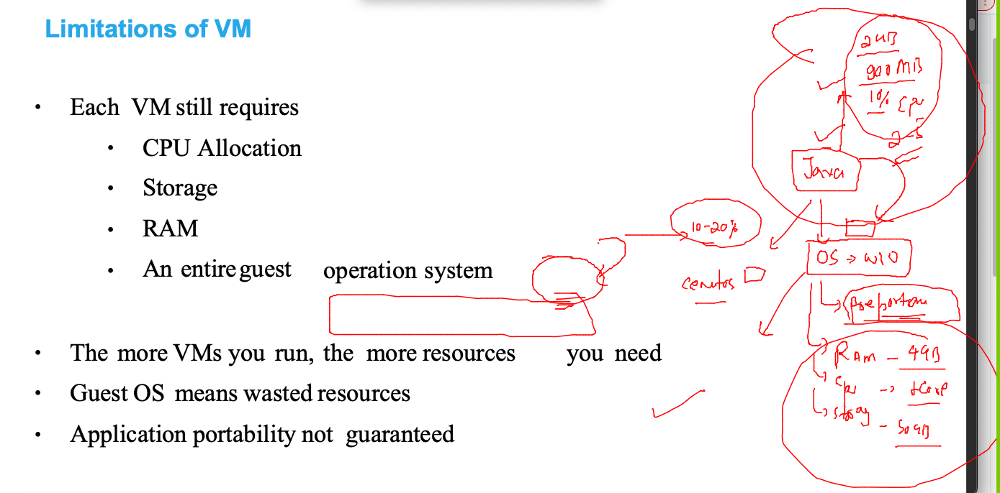
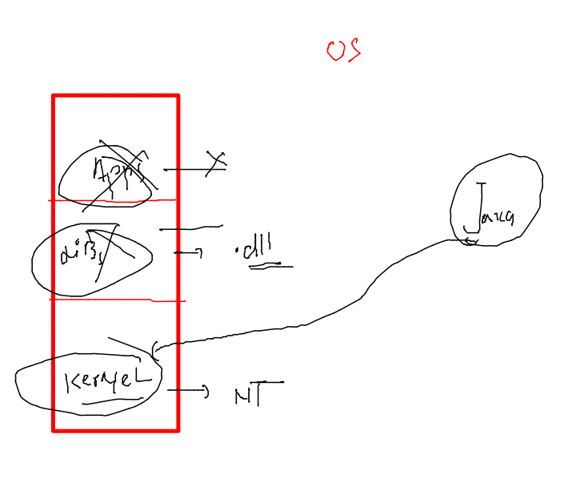
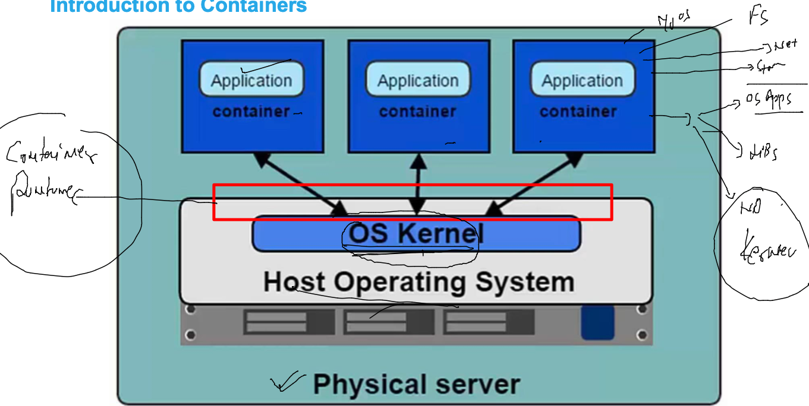
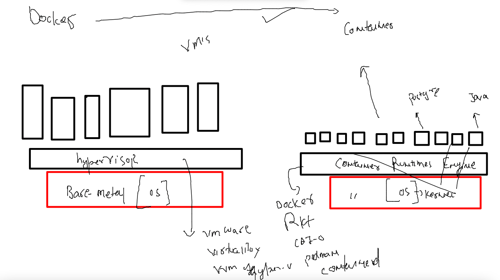
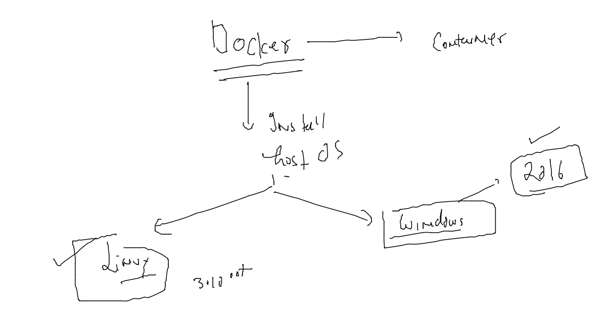

# mobileum_cna_may162022

## Session Plan :-  


### app deployment probelms in History 


### problem with VM 



### OS understanding 



### Introduction to containers 



### VM vs containers 



### Docker as container  platform 



### Docker installation on Host cloud 

```
 7  for  i  in  ashu  alex arpita atri mota dave david deepa lepipas  rosas indrajeet lopes lam   malli matt neha nikos nitin pradeep sanaya shah bruce  steven tsaimos ; do useradd $i; echo "Docker@099#"  |  passwd $i --stdin ; done
    8  vim /etc/ssh/sshd_config 
    9  systemctl restart sshd
   10  history 
   11  yum  install  docker -y
   12  systemctl start docker
   13  systemctl status docker
   14  systemctl enable  docker
```

### Non root users can't use docker access 

```
[ashu@ip-172-31-31-222 ~]$ whoami
ashu
[ashu@ip-172-31-31-222 ~]$ docker  version 
Client:
 Version:           20.10.13
 API version:       1.41
 Go version:        go1.16.15
 Git commit:        a224086
 Built:             Thu Mar 31 19:20:32 2022
 OS/Arch:           linux/amd64
 Context:           default
 Experimental:      true
Got permission denied while trying to connect to the Docker daemon socket at unix:///var/run/docker.sock: Get "http://%2Fvar%2Frun%2Fdocker.sock/v1.24/version": dial unix /var/run/docker.sock: connect: permission denied
```

### solution -- ON the docker server side 

```
 for  i  in  ashu  alex arpita atri mota dave david deepa lepipas  rosas indrajeet lopes lam   malli matt neha nikos nitin pradeep sanaya shah bruce  steven tsaimos 
> do
> usermod -aG docker  $i 
> done
[root@ip-172-31-31-222 ~]# 
[root@ip-172-31-31-222 ~]# 
[root@ip-172-31-31-222 ~]# grep -i docker  /etc/group
docker:x:992:ashu,alex,arpita,atri,mota,dave,david,deepa,lepipas,rosas,indrajeet,lopes,lam,malli,matt,neha,nikos,nitin,pradeep,sanaya,shah,bruce,steven,tsaimos
[root@ip-172-31-31-222 ~]# 
[root@ip-172-31-31-222 ~]# 
[root@ip-172-31-31-222 ~]# usermod -a -G  docker  ec2-user
[root@ip-172-31-31-222 ~]# 


```


