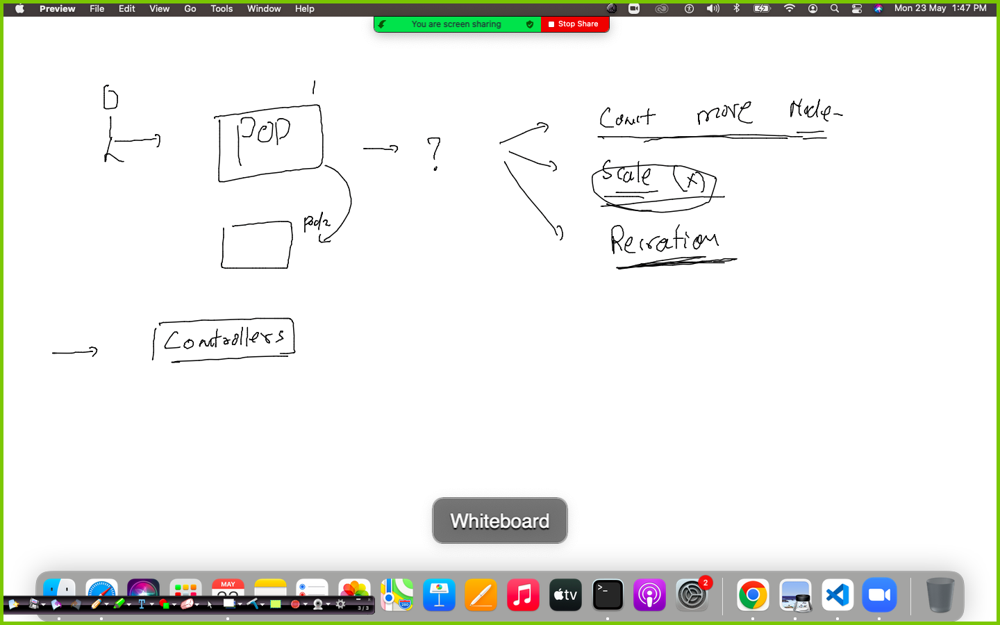
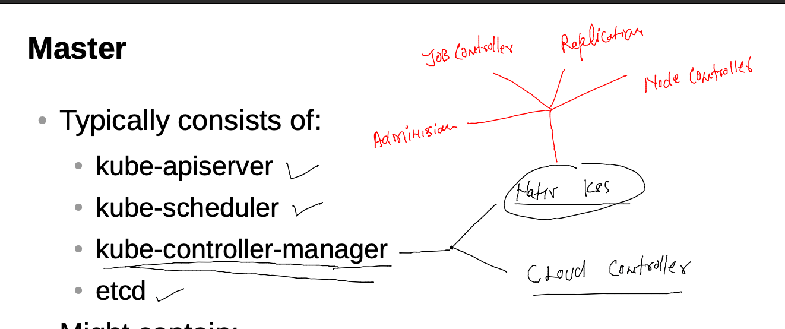

# mobileum_cna_may162022

## Session Plan :-  


## Recreating namespace and setting it as default 

```
kubectl get  ns
NAME              STATUS   AGE
default           Active   20m
kube-node-lease   Active   20m
kube-public       Active   20m
kube-system       Active   20m
[ashu@client-machine ~]$ kubectl create  ns  ashu-space 
namespace/ashu-space created
[ashu@client-machine ~]$ kubectl get ns
NAME              STATUS   AGE
ashu-space        Active   4s
default           Active   20m
kube-node-lease   Active   20m
kube-public       Active   20m
kube-system       Active   20m
[ashu@client-machine ~]$ kubectl get po
No resources found in default namespace.
[ashu@client-machine ~]$ kubectl config set-context --current --namespace=ashu-space
Context "kubernetes-admin@kubernetes" modified.
[ashu@client-machine ~]$ 


```

### checking current namespace 

```
kubectl  config get-contexts 
CURRENT   NAME                          CLUSTER      AUTHINFO           NAMESPACE
*         kubernetes-admin@kubernetes   kubernetes   kubernetes-admin   ashu-space
```

### Understanding problems with POD 


### Intro to controllers in k8s 




