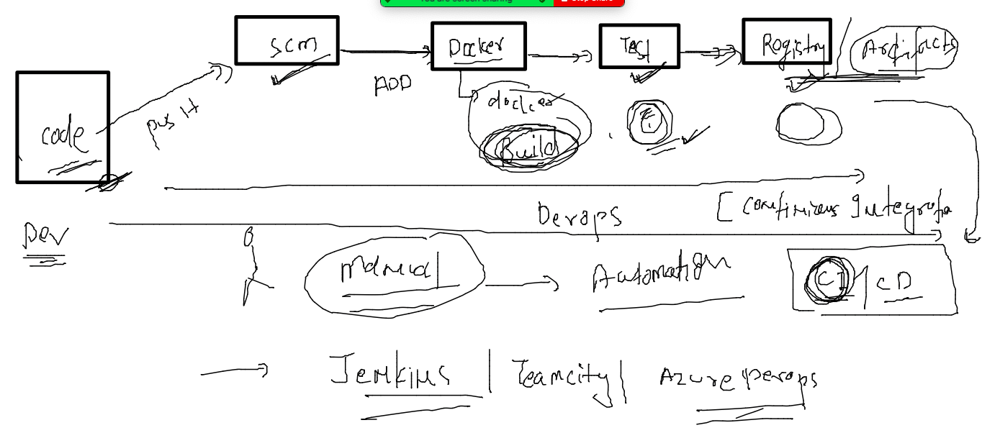
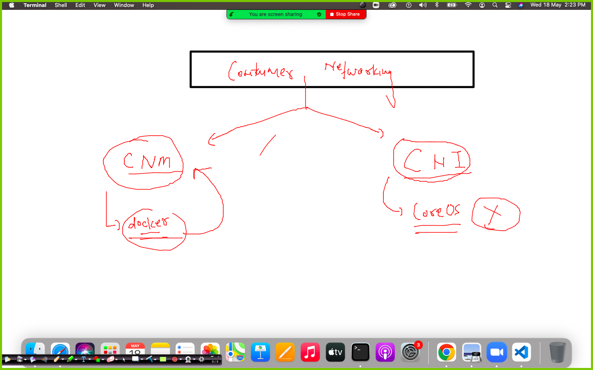
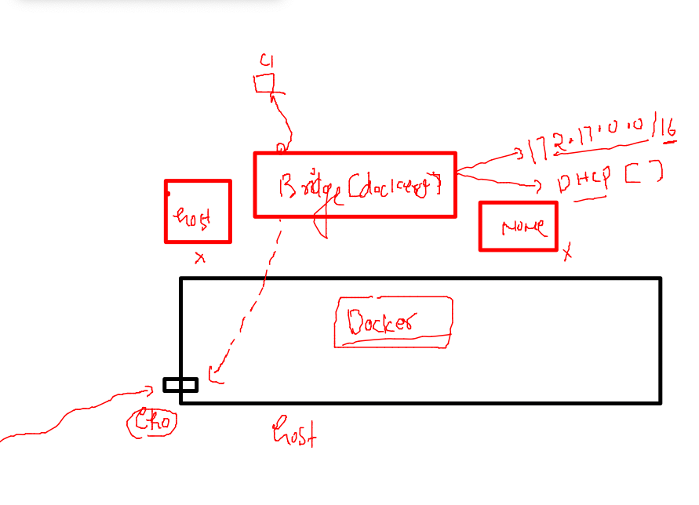
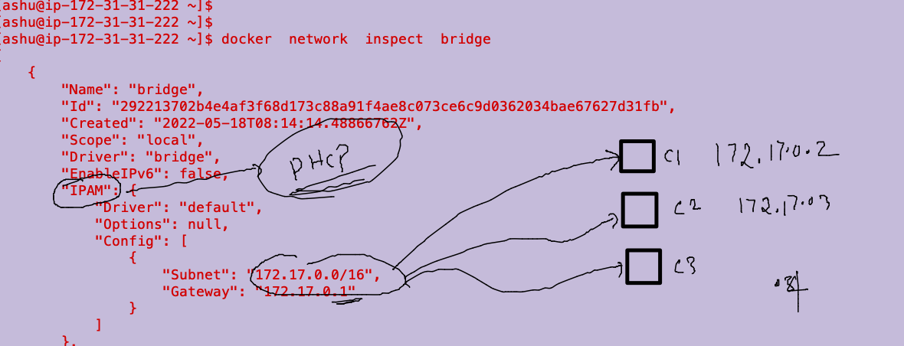
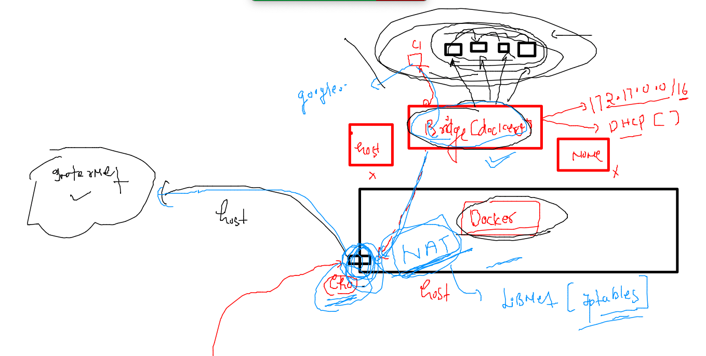
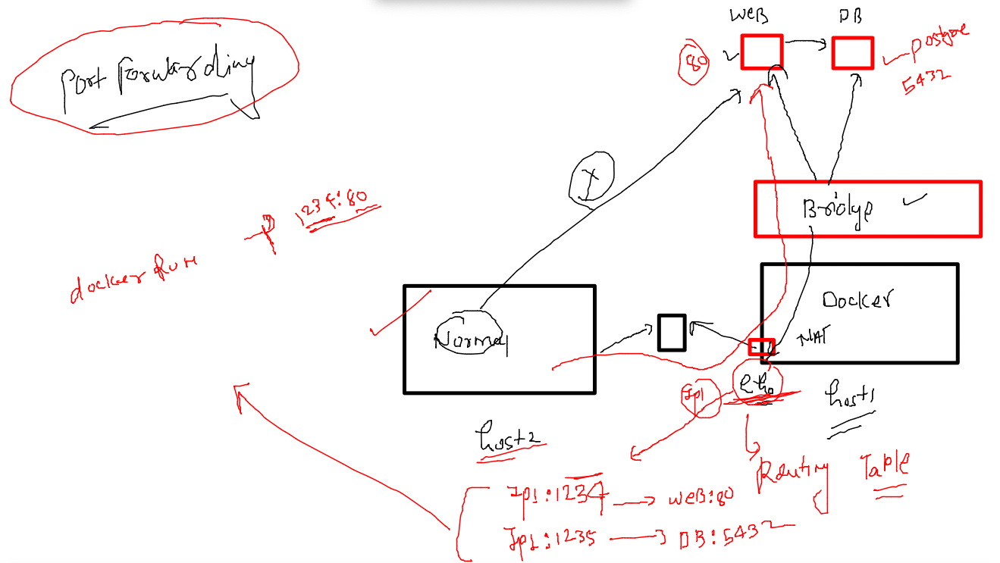
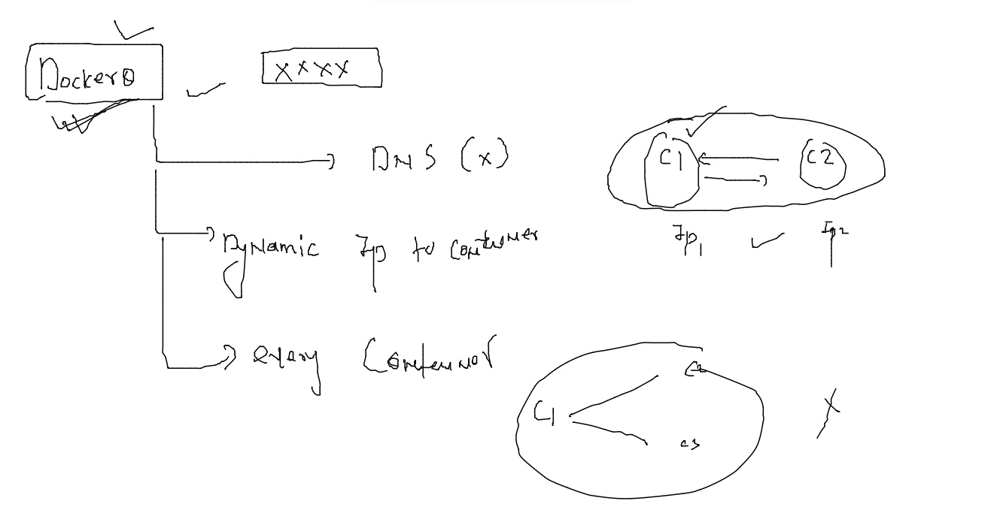
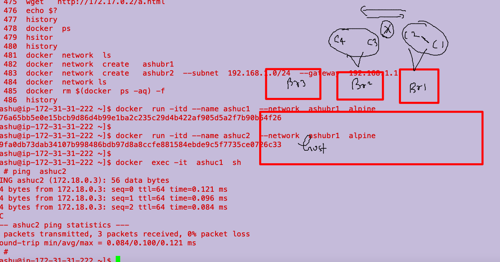

# mobileum_cna_may162022

## Session Plan :-  


### AUTOmation using jenkins [CI|CD]



## COntainer networking 

### networking modesl 



### Docker bridge 



### default offering by docker in terms of networking 

```
docker  network   ls
NETWORK ID     NAME      DRIVER    SCOPE
292213702b4e   bridge    bridge    local
1c268364e90f   host      host      local
c6ccda1f2c68   none      null      local
[ashu@ip-172-31-31-222 ~]$ 
[ashu@ip-172-31-31-222 ~]$ 
[ashu@ip-172-31-31-222 ~]$ docker  network  inspect  bridge 
[
    {
        "Name": "bridge",
        "Id": "292213702b4e4af3f68d173c88a91f4ae8c073ce6c9d0362034bae67627d31fb",
        "Created": "2022-05-18T08:14:14.48866762Z",
        "Scope": "local",
        "Driver": "bridge",
        "EnableIPv6": false,
        "IPAM": {
            "Driver": "default",
            "Options": null,
            "Config": [
                {
                    "Subnet": "172.17.0.0/16",
                    "Gateway": "172.17.0.1"

```

### all containers by default fall in default bridge for network purpose 



### creating container and check IP address 

```
docker  run  -itd  --name  ashuc1  ashuwebapp:v001
2728474cbf22b0e09cbcf5b87d84d9ee74f32801c3c686ba05d77ae23bc8bf4b
[ashu@ip-172-31-31-222 ~]$ docker  ps
CONTAINER ID   IMAGE             COMMAND                  CREATED          STATUS          PORTS     NAMES
2728474cbf22   ashuwebapp:v001   "/docker-entrypoint.…"   14 seconds ago   Up 12 seconds   80/tcp    ashuc1
[ashu@ip-172-31-31-222 ~]$ 


```

###

```
docker  inspect  ashuc1  --format='{{.NetworkSettings.IPAddress}}'
172.17.0.2

```

### container in the same bridge can by default communicate to each others

```
 
[ashu@ip-172-31-31-222 ~]$ docker  exec -it testc1 sh 
/ # 
/ # ping  172.17.0.19
PING 172.17.0.19 (172.17.0.19): 56 data bytes
64 bytes from 172.17.0.19: seq=0 ttl=64 time=0.202 ms
64 bytes from 172.17.0.19: seq=1 ttl=64 time=0.081 ms
^C
--- 172.17.0.19 ping statistics ---

```
### NAT rule is default settting using iptables with docker bridge 



### to expose container apps outside docker host we need to use linux routing table using port forwarding concept 



### problem with default docker bridge 



### creating custom docker bridges 

```
docker  network  create   ashubr1 
f17676801f398f411ec5b1c604264a114afb41d7e24935f6604b2bbdb661ce68
[ashu@ip-172-31-31-222 ~]$ docker  network  create   ashubr2  --subnet  192.168.1.0/24  --gateway  192.168.1.1 
bc77949314e14f51074ab736539c41a01ee53acfa34c440bf6910ffed1fd0b7f
[ashu@ip-172-31-31-222 ~]$ docker  network ls
NETWORK ID     NAME         DRIVER    SCOPE
05de29584d29   alexbr1      bridge    local
c755f2f51fb2   alexbr2      bridge    local
f17676801f39   ashubr1      bridge    local
bc77949314e1   ashubr2      bridge    local
```

### more bridge concpet 




