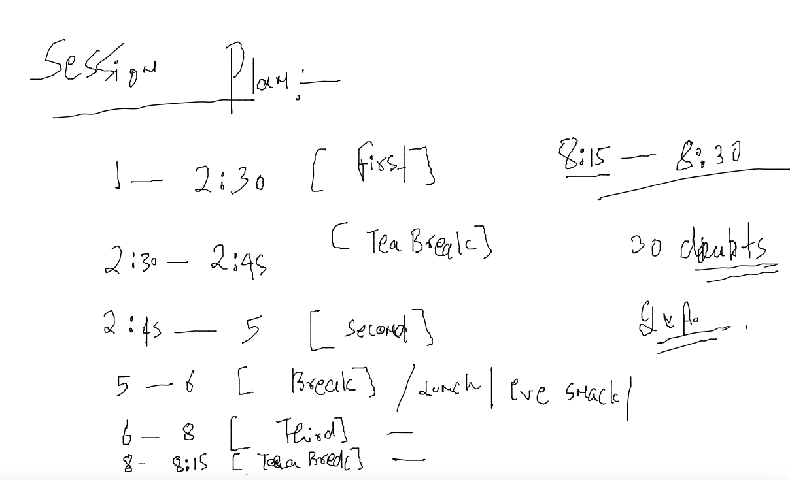
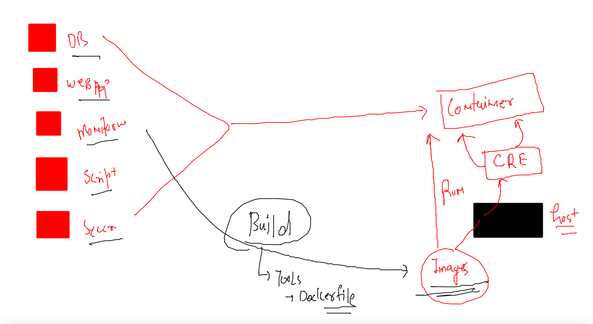

# mobileum_cna_may162022

## Session Plan :-  



### docker host store all the docker related data at given location 

```

[root@ip-172-31-31-222 ~]# cd /var/lib/docker/
[root@ip-172-31-31-222 docker]# ls
buildkit  containers  image  network  overlay2  plugins  runtimes  swarm  tmp  trust  volumes
[root@ip-172-31-31-222 docker]# docker  images
REPOSITORY                   TAG        IMAGE ID       CREATED        SIZE
alexapp                      2.1    

```

###

```
 docker  info   |   grep -i root
 Docker Root Dir: /var/lib/docker
```

### app containerization steps 



### java sample code --containerization 

```
 ls
helloc1.txt  images
[ashu@ip-172-31-31-222 ~]$ cd images/
[ashu@ip-172-31-31-222 images]$ ls
python_app_image
[ashu@ip-172-31-31-222 images]$ mkdir  java-code 
[ashu@ip-172-31-31-222 images]$ ls
java-code  python_app_image
[ashu@ip-172-31-31-222 images]$ ls
java-code  python_app_image
[ashu@ip-172-31-31-222 images]$ cd  java-code/
[ashu@ip-172-31-31-222 java-code]$ ls
[ashu@ip-172-31-31-222 java-code]$ wget https://raw.githubusercontent.com/redashu/javaLang/main/test.java
--2022-05-17 08:23:53--  https://raw.githubusercontent.com/redashu/javaLang/main/test.java
Resolving raw.githubusercontent.com (raw.githubusercontent.com)... 185.199.111.133, 185.199.110.133, 185.199.109.133, ...
Connecting to raw.githubusercontent.com (raw.githubusercontent.com)|185.199.111.133|:443... connected.
HTTP request sent, awaiting response... 200 OK
Length: 226 [text/plain]
Saving to: 'test.java'

100%[==================================================================================================>] 226         --.-K/s   in 0s      

2022-05-17 08:23:53 (18.2 MB/s) - 'test.java' saved [226/226]

[ashu@ip-172-31-31-222 java-code]$ ls
test.java

```

### build this

```
docker  build  -t  ashujava:codev1  . 
Sending build context to Docker daemon  3.072kB
Step 1/8 : FROM openjdk
 ---> 5e28ba2b4cdb
Step 2/8 : LABEL name=ashutoshh
 ---> Running in 7237c89c6d37
Removing intermediate container 7237c89c6d37
 ---> 839a3c5b537f
Step 3/8 : LABEL email=ashutoshh@linux.com
 ---> Running in 22ca5d9c172a
Removing intermediate container 22ca5d9c172a
 ---> 02e4c739f0c6
Step 4/8 : RUN mkdir /javacode
 ---> Running in d75a0867a9b9
Removing intermediate container d75a0867a9b9
 ---> d4cc8639d4d0


```

### running java code 

```
 197  docker  run -it -d --name  ashujc1  ashujava:codev1 
  198  docker  ps
  199  docker  stats
  200  history 
[ashu@ip-172-31-31-222 java-code]$ docker  ps
CONTAINER ID   IMAGE                COMMAND          CREATED              STATUS              PORTS     NAMES
e9253378f31d   deepajava:codev1     "java myclass"   11 seconds ago       Up 7 seconds                  deepaTest
26d08c6a56de   tsaimosjava:codev1   "java myclass"   15 seconds ago       Up 11 seconds                 tsaimosjc1
39470184110a   nyjava:codev1        "java myclass"   15 seconds ago       Up 12 seconds                 nyc1
435ca9687a75   mattjapp:1.0         "java myclass"   16 seconds ago       Up 13 seconds                 mattjc1

```

## docker pro tips 

### stop all the running container gracefully 

```
docker  stop  $(docker  ps -q)
```

### forcefully 

```
[ashu@ip-172-31-31-222 python_app_image]$ docker kill  $(docker  ps -q)
a5e9efd7df02
c0721e7f7ba0
0397765d792d
564255ec1b09
a57f8f98e8d0
85d53c92f835
943c3ee2f248

```

### remove all the non running container 

```
 docker rm   $(docker  ps -qa)
a5e9efd7df02
c0721e7f7ba0
0397765d792d
564255ec1b09
a57f8f98e8d0
85d53c92f835

```

### understanding docker image layering system 

```
[ashu@ip-172-31-31-222 python_app_image]$ docker history ashujava:codev1 
IMAGE          CREATED          CREATED BY                                      SIZE      COMMENT
b440561cdddb   19 minutes ago   /bin/sh -c #(nop)  CMD ["java" "myclass"]       0B        
e713eba512ff   19 minutes ago   /bin/sh -c javac test.java                      439B      
30b107c6446c   19 minutes ago   /bin/sh -c #(nop) WORKDIR /javacode             0B        
f1549e98c19a   19 minutes ago   /bin/sh -c #(nop) COPY file:3500d8c717bfeb64…   226B      
d4cc8639d4d0   19 minutes ago   /bin/sh -c mkdir /javacode                      0B        
02e4c739f0c6   19 minutes ago   /bin/sh -c #(nop)  LABEL email=ashutoshh@lin…   0B        
839a3c5b537f   19 minutes ago   /bin/sh -c #(nop)  LABEL name=ashutoshh         0B        
5e28ba2b4cdb   2 weeks ago      /bin/sh -c #(nop)  CMD ["jshell"]               0B        
<missing>      2 weeks ago      /bin/sh -c set -eux;   arch="$(objdump="$(co…   321MB     
<missing>      2 weeks ago      /bin/sh -c #(nop)  ENV JAVA_VERSION=17.0.2      0B        
<missing>      2 weeks ago      /bin/sh -c #(nop)  ENV LANG=C.UTF-8             0B        
<missing>      2 weeks ago      /bin/sh -c #(nop)  ENV PATH=/usr/java/openjd…   0B        
<missing>      2 weeks ago      /bin/sh -c #(nop)  ENV JAVA_HOME=/usr/java/o…   0B        
<missing>      2 weeks ago      /bin/sh -c set -eux;  microdnf install   gzi…   39.7MB    
<missing>      2 weeks ago      /bin/sh -c #(nop)  CMD ["/bin/bash"]            0B        
<missing>      2 weeks ago      /bin/sh -c #(nop) ADD file:9893213a9ea238f53…   111MB     
[ashu@ip-172-31-31-222 python_app_image]$ docker  images  |  grep openjdk
openjdk                      latest     5e28ba2b4cdb   2 weeks ago      471MB
[ashu@ip-172-31-31-222 python_app_image]$ docker  images  |  grep ashujava
ashujava                     codev1     b440561cdddb   21 minutes ago   471MB
[ashu@ip-172-31-31-222 python_app_image]$ 
[ashu@ip-172-31-31-222 python_app_image]$ docker  run -it --rm  02e4c739f0c6  bash 
bash-4.4# ls /
bin  boot  dev	etc  home  lib	lib64  media  mnt  opt	proc  root  run  sbin  srv  sys  tmp  usr  var
bash-4.4# exit
[ashu@ip-172-31-31-222 python_app_image]$ docker  run -it --rm  d4cc8639d4d0  bash 
bash-4.4# ls /
bin  boot  dev	etc  home  javacode  lib  lib64  media	mnt  opt  proc	root  run  sbin  srv  sys  tmp	usr  var
bash-4.4# exit
exit

```

### Understanding CMD instruction in Dockerfile 

```
docker run -itd --name test1  b440561cdddb  
f5659a7ce9694460b6209cdecb6cb726b8e80b33893c04082b2a80c946fa6770
[ashu@ip-172-31-31-222 java-code]$ 
[ashu@ip-172-31-31-222 java-code]$ docker  ps
CONTAINER ID   IMAGE          COMMAND          CREATED         STATUS         PORTS     NAMES
f5659a7ce969   b440561cdddb   "java myclass"   3 seconds ago   Up 2 seconds             test1
[ashu@ip-172-31-31-222 java-code]$ 
[ashu@ip-172-31-31-222 java-code]$ docker run -itd --name test2  b440561cdddb  bash 
7c4308b37b993a59693123fb01af6e62f390b2277270ac391d10e776d51f35c9
[ashu@ip-172-31-31-222 java-code]$ cat  Dockerfile 
FROM openjdk 
# java supported image from ORacle 
LABEL name=ashutoshh
LABEL email=ashutoshh@linux.com
RUN mkdir /javacode 
COPY test.java /javacode/
WORKDIR  /javacode 
# changing working directory to above like cd commnad in nix 
RUN javac test.java 
# compiling code of java 
CMD ["java","myclass"]
# to define default parent process of container 
[ashu@ip-172-31-31-222 java-code]$ docker  ps
CONTAINER ID   IMAGE          COMMAND          CREATED          STATUS          PORTS     NAMES
7c4308b37b99   b440561cdddb   "bash"           16 seconds ago   Up 14 seconds             test2
f5659a7ce969   b440561cdddb   "java myclass"   34 seconds ago   Up 32 seconds             test1
```
### ENtrypoint in Dockerfile 

```
[ashu@ip-172-31-31-222 java-code]$ cat  Dockerfile 
FROM openjdk 
# java supported image from ORacle 
LABEL name=ashutoshh
LABEL email=ashutoshh@linux.com
RUN mkdir /javacode 
COPY test.java /javacode/
WORKDIR  /javacode 
# changing working directory to above like cd commnad in nix 
RUN javac test.java 
# compiling code of java 
#CMD ["java","myclass"]
ENTRYPOINT  java myclass 
# replacement of CMD 
# to define default parent process of container
```

### Demo 

```
 255  docker  build -t  ashujava:codev2 . 
  256  history 
[ashu@ip-172-31-31-222 java-code]$ docker run -itd --name test3  ashujava:codev2  
4a978dd3f994ba717388c6adb619b3df0aa485b6ab3b257b3103b1652c47fc2e
[ashu@ip-172-31-31-222 java-code]$ docker  ps
CONTAINER ID   IMAGE             COMMAND                  CREATED         STATUS         PORTS     NAMES
4a978dd3f994   ashujava:codev2   "/bin/sh -c 'java my…"   3 seconds ago   Up 1 second              test3
7c4308b37b99   b440561cdddb      "bash"                   2 minutes ago   Up 2 minutes             test2
f5659a7ce969   b440561cdddb      "java myclass"           2 minutes ago   Up 2 minutes             test1
[ashu@ip-172-31-31-222 java-code]$ docker run -itd --name test4  ashujava:codev2  bash 
90cb58976d4c3c388e5a912e38ca359e426f889cfa4af52b46173f6fdbb0aac3
[ashu@ip-172-31-31-222 java-code]$ docker  ps
CONTAINER ID   IMAGE             COMMAND                  CREATED          STATUS          PORTS     NAMES
90cb58976d4c   ashujava:codev2   "/bin/sh -c 'java my…"   5 seconds ago    Up 2 seconds              test4
4a978dd3f994   ashujava:codev2   "/bin/sh -c 'java my…"   24 seconds ago   Up 22 seconds             test3
```

### Entrypoint and CMD together 

```
 ls  -a
.  ..  .dockerignore  Dockerfile  hello.java  test.java
[ashu@ip-172-31-31-222 java-code]$ cat  .dockerignore 
Dockerfile
.dockerignore
[ashu@ip-172-31-31-222 java-code]$ cat  Dockerfile 
FROM openjdk 
# java supported image from ORacle 
LABEL name=ashutoshh
LABEL email=ashutoshh@linux.com
RUN mkdir /javacode 
COPY .  /javacode/
# current location of dockerfile everything will be copied to /javacode 
WORKDIR  /javacode 
# changing working directory to above like cd commnad in nix 
RUN javac * 
# compiling code of java 
ENTRYPOINT ["java"]
CMD ["hello"]
# process java hello / during container creation time myclass 
[ashu@ip-172-31-31-222 java-code]$ docker build -t  ashujava:codev2 . 
Sending build context to Docker daemon   5.12kB
Step 1/9 : FROM openjdk
 ---> 5e28ba2b4cdb
Step 2/9 : LABEL name=ashutoshh
 ---> Using cache
 ---> 839a3c5b537f
Step 3/9 : LABEL email=ashutoshh@linux.com
 ---> Using cache
 ---> 02e4c739f0c6
Step 4/9 : RUN mkdir /javacode

```

### testing 

```
docker run -itd  --name ashujc1  ashujava:codev2 
8bdd1dca33a177bb1b826c49dbb13db52ee1a8d9beea59385275d043a0987127
[ashu@ip-172-31-31-222 java-code]$ docker  ps
CONTAINER ID   IMAGE                COMMAND        CREATED              STATUS              PORTS     NAMES
8bdd1dca33a1   ashujava:codev2      "java hello"   5 seconds ago        Up 1 second                   ashujc1
8194faff7c9f   davidjava:2.0        "java hello"   38 seconds ago       Up 36 seconds                 davidjavac2
4e80814d67bd   lepipasjava:codev2   "java hello"   About a minute ago   Up About a minute             lepipasc2
[ashu@ip-172-31-31-222 java-code]$ docker run -itd  --name ashujc2  ashujava:codev2  myclass
f143ae587c186fe08e3dfbd6d47537cb7bee26ebd0f4251a3823a7202a5ac13f
[ashu@ip-172-31-31-222 java-code]$ docker  ps
CONTAINER ID   IMAGE                COMMAND          CREATED              STATUS              PORTS     NAMES
f143ae587c18   ashujava:codev2      "java myclass"   5 seconds ago        Up 1 second                   ashujc2
819c60913cc2   deepajava:codev2     "java hello"     11 seconds ago       Up 8 seconds                  deepaTest2
3e5b406e5f36   motajava:codev2      "java hello"     11 seconds ago       Up 9 seconds                  motac1
f3ff6bbf09f2   pradeepjava:2.0      "java hello"     13 seconds ago       Up 11 seconds                 pradeepc1
fcbd25ba6230   alexjava:codev2      "java hello"     15 seconds ago       Up 13 seconds                 alexjc1
8bdd1dca33a1   ashujava:codev2      "java hello"     26 seconds ago       Up 23 seconds                 ashujc1

```

### final dockerfile 

```
FROM openjdk 
# java supported image from ORacle 
LABEL name=ashutoshh
LABEL email=ashutoshh@linux.com
RUN mkdir /javacode 
COPY .  /javacode/
# current location of dockerfile everything will be copied to /javacode 
WORKDIR  /javacode 
# changing working directory to above like cd commnad in nix 
RUN javac *  &&  useradd jack 
USER jack 
# now container will be created using jack user privilige
# compiling code of java 
ENTRYPOINT ["java"]
CMD ["hello"]
# process java hello / during container creation time myclass 
```

### pushing image to ACR 

```
 docker  tag  ashujava:codev3    ashutoshh.azurecr.io/ashujava:codev3
[ashu@ip-172-31-31-222 java-code]$ 
[ashu@ip-172-31-31-222 java-code]$ docker login  ashutoshh.azurecr.io
Username: ashutoshh
Password: 
WARNING! Your password will be stored unencrypted in /home/ashu/.docker/config.json.
Configure a credential helper to remove this warning. See
https://docs.docker.com/engine/reference/commandline/login/#credentials-store

Login Succeeded
[ashu@ip-172-31-31-222 java-code]$ docker push  ashutoshh.azurecr.io/ashujava:codev3
The push refers to repository [ashutoshh.azurecr.io/ashujava]
4877ed25e942: Pushed 
84aec137aa8c: Pushed 
9ce9c3e01ad9: Pushed 
dc9fa3d8b576: Pushing [=============>                                     ]  86.99MB/321.3MB
27ee19dc88f2: Pushed 

docker logout  ashutoshh.azurecr.io
```
