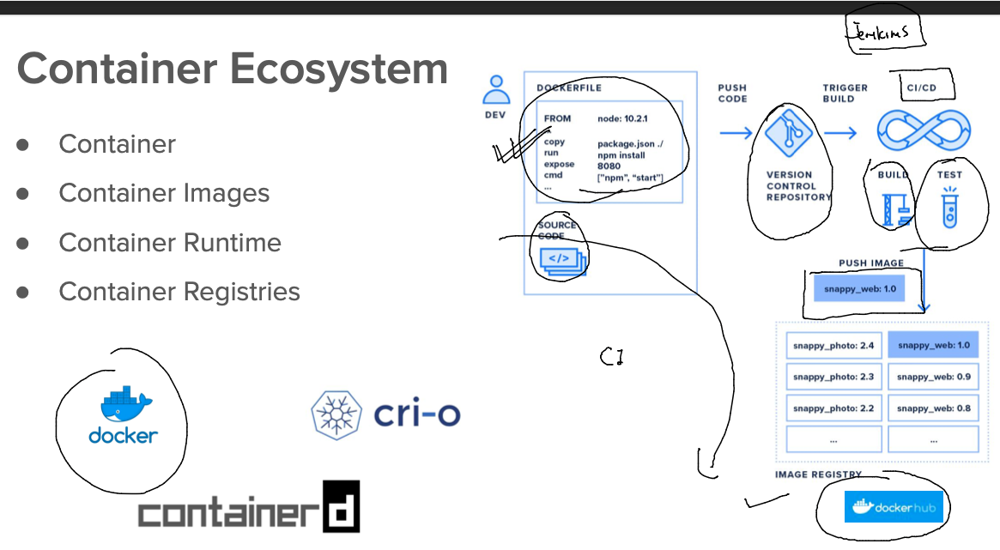
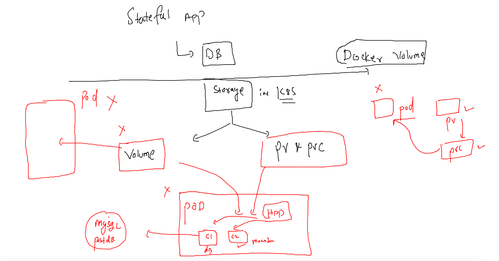
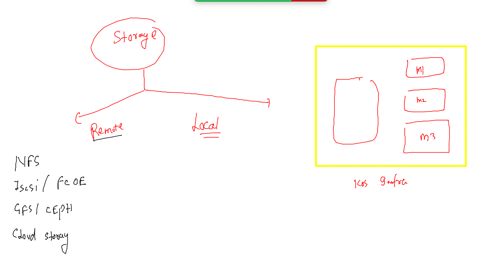
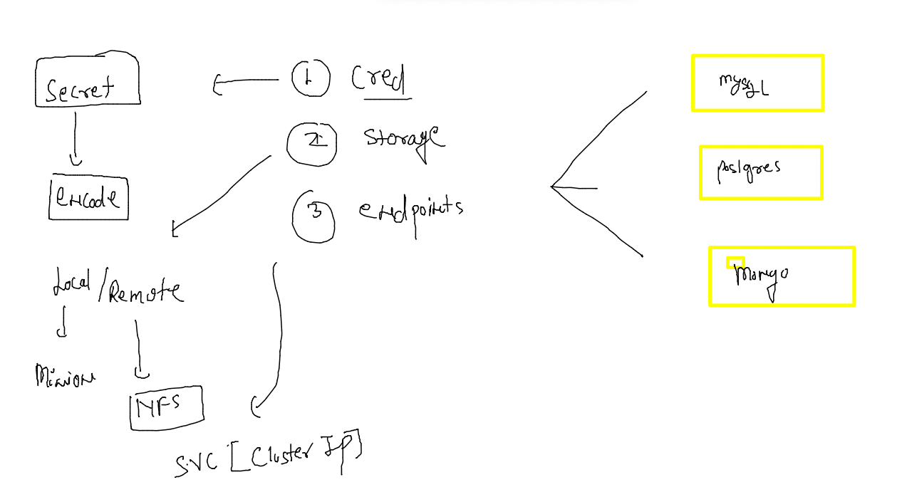
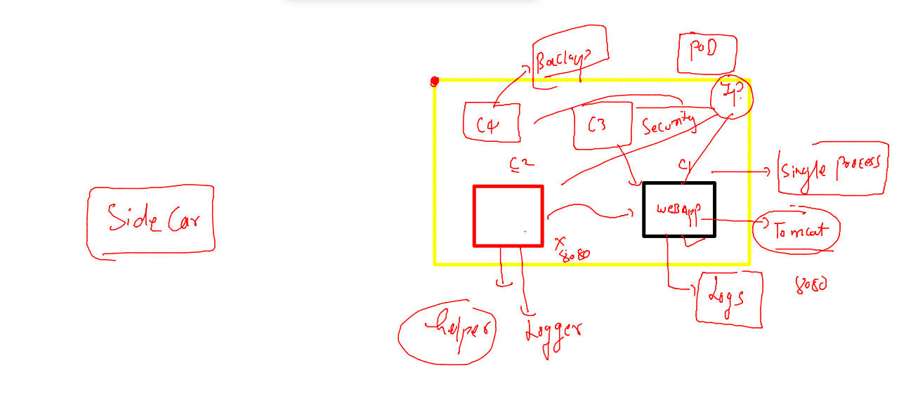
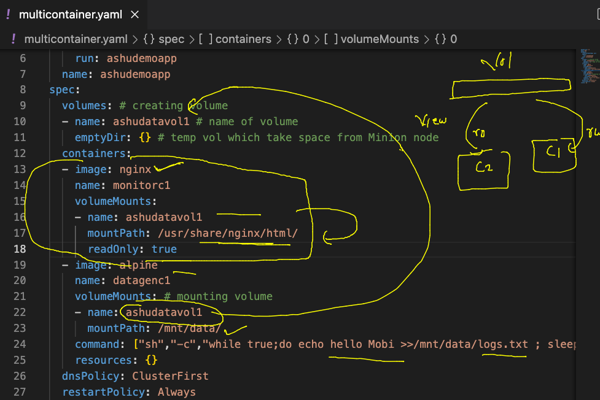
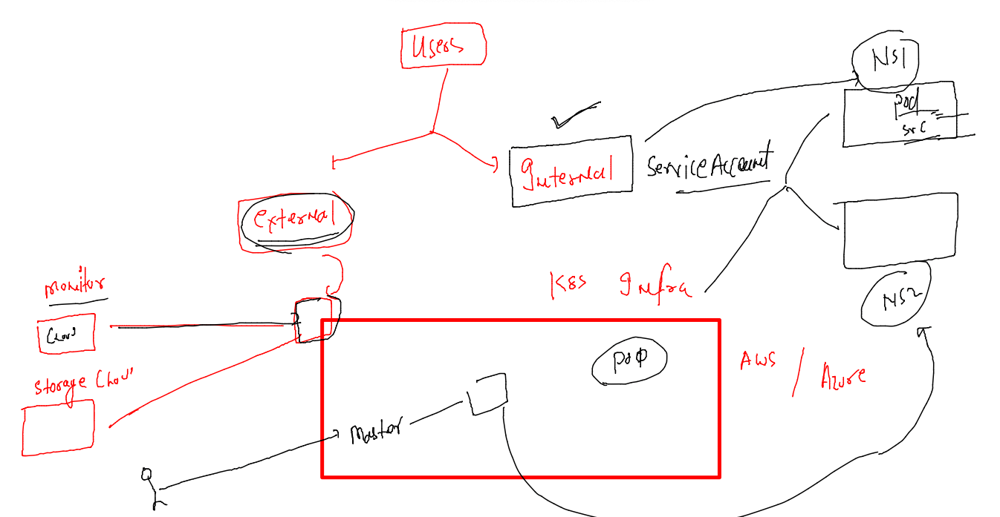
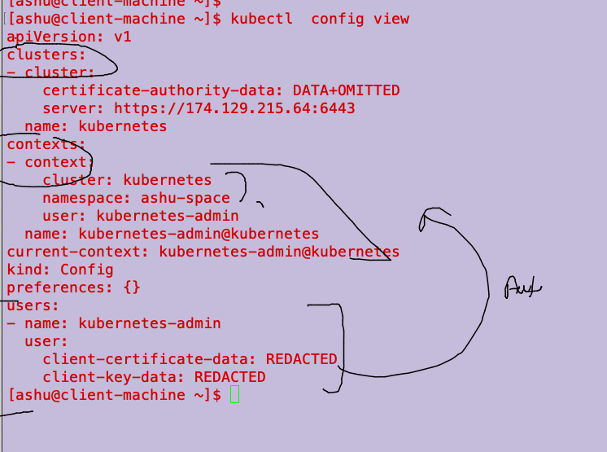
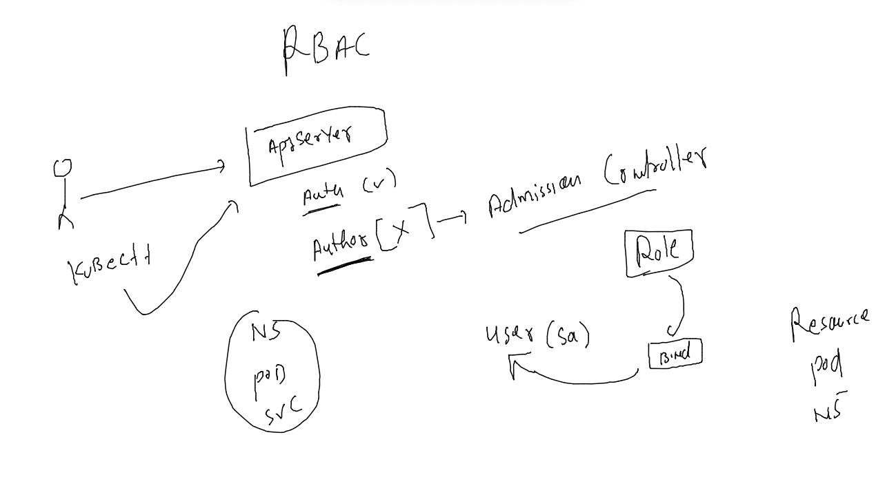

# mobileum_cna_may162022

## Session Plan :-  


## Revision of past days 



## Intro to kubernetes Storage 



### Storage source for k8s 

[Link](https://kubernetes.io/docs/concepts/storage/volumes/)



### Deploy db in k8s 



## MYsql DB deployment using deploy controller 

### creating yaml file 

```
kubectl create  deployment  ashu-mysql  --image=mysql --port 3306  --dry-run=client -o yaml   >mysql.yaml
```

### creating secret to store Db root user cred 

```
 kubectl  create  secret  
Create a secret using specified subcommand.

Available Commands:
  docker-registry   Create a secret for use with a Docker registry
  generic           Create a secret from a local file, directory, or literal value
  tls               Create a TLS secret

Usage:
  kubectl create secret [flags] [options]

Use "kubectl <command> --help" for more information about a given command.
Use "kubectl options" for a list of global command-line options (applies to all commands).
[ashu@client-machine ~]$ kubectl  create  secret  generic  ashumysql-cred  --from-literal sql_pass="Docker@099#" --dry-run=client  -o yaml 
apiVersion: v1
data:
  sql_pass: RG9ja2VyQDA5OSM=
kind: Secret
metadata:
  creationTimestamp: null
  name: ashumysql-cred

```

### secret YAML 

```
[ashu@client-machine ~]$ cat  mysql_cred.yaml 
apiVersion: v1
data:
  sql_pass: RG9ja2VyQDA5OSM=
kind: Secret
metadata:
  creationTimestamp: null
  name: ashumysql-cred
```

### MYsql Deploy YAML 

```
[ashu@client-machine ~]$ cat mysql.yaml 
apiVersion: apps/v1
kind: Deployment
metadata:
  creationTimestamp: null
  labels:
    app: ashu-mysql
  name: ashu-mysql # name of deployment 
spec:
  replicas: 1 
  selector:
    matchLabels:
      app: ashu-mysql
  strategy: {}
  template: # will be used to create POD 
    metadata:
      creationTimestamp: null
      labels:
        app: ashu-mysql
    spec:
      volumes: # creating volumes 
      - name: ashudbvol1 
        hostPath: # we are taking storage from Minion node 
         path: /common/ashudb1 
         type: DirectoryOrCreate # on the minion if directory is not present then create it
      containers: # creating containers 
      - image: mysql
        name: mysql
        ports:
        - containerPort: 3306
        env: # use / create ENV varibale 
        - name: MYSQL_ROOT_PASSWORD 
          valueFrom: # reading value from somewhere 
           secretKeyRef: # reading password from secret 
             name: ashumysql-cred # name of secret 
             key: sql_pass # key of secret 
        volumeMounts: # to mount / attach to the pod container 
        - name: ashudbvol1  # name of volume 
          mountPath: /var/lib/mysql/ # mount path inside container 
        resources: {}


```

### Deploy it 

```
[ashu@client-machine ~]$ kubectl create  -f  mysql_cred.yaml  -f  mysql.yaml  
secret/ashumysql-cred created
deployment.apps/ashu-mysql created
[ashu@client-machine ~]$ kubectl  get  secret 
NAME             TYPE                                  DATA   AGE
ashumysql-cred   Opaque                                1      12s
ashusec1         kubernetes.io/dockerconfigjson        1      18h
default          kubernetes.io/service-account-token   3      21h
[ashu@client-machine ~]$ kubectl  get  deploy 
NAME         READY   UP-TO-DATE   AVAILABLE   AGE
ashu-mysql   1/1     1            1           21s
[ashu@client-machine ~]$ kubectl  get  po
NAME                          READY   STATUS    RESTARTS   AGE
ashu-mysql-78665bbfbb-zdhsv   1/1     Running   0          25s
[ashu@client-machine ~]$ kubectl  logs ashu-mysql-78665bbfbb-zdhsv
2022-05-24 08:59:08+00:00 [Note] [Entrypoint]: Entrypoint script for MySQL Server 8.0.29-1debian10 started.
2022-05-24 08:59:08+00:00 [Note] [Entrypoint]: Switching to dedicated user 'mysql'
2022-05-24 08:59:08+00:00 [Note] [Entrypoint]: En
```
### Deploy Svc EP 

```
 kubectl  get  deploy 
NAME         READY   UP-TO-DATE   AVAILABLE   AGE
ashu-mysql   1/1     1            1           5m26s
[ashu@client-machine ~]$ kubectl expose deploy  ashu-mysql  --type ClusterIP --port 3306  --name mysqllb1
service/mysqllb1 exposed
[ashu@client-machine ~]$ kubectl  get  svc
NAME       TYPE        CLUSTER-IP       EXTERNAL-IP   PORT(S)    AGE
mysqllb1   ClusterIP   10.100.154.126   <none>        3306/TCP   4s
[ashu@client-machine ~]$ 
[ashu@client-machine ~]$ kubectl  get po -owide
NAME                          READY   STATUS    RESTARTS   AGE     IP              NODE    NOMINATED NODE   READINESS GATES
ashu-mysql-78665bbfbb-zdhsv   1/1     Running   0          6m28s   192.168.104.1   node2   <none>           <none>
[ashu@client-machine ~]$ 
[ashu@client-machine ~]$ kubectl  get  eip 
error: the server doesn't have a resource type "eip"
[ashu@client-machine ~]$ kubectl  get  ep
NAME       ENDPOINTS            AGE
mysqllb1   192.168.104.1:3306   33s

```
## Postgres Example 

```
 cat  postgres.yaml 
apiVersion: apps/v1
kind: Deployment
metadata:
  creationTimestamp: null
  labels:
    app: alex-postgres
  name: alex-postgres
spec:
  replicas: 1
  selector:
    matchLabels:
      app: alex-postgres
  strategy: {}
  template:
    metadata:
      creationTimestamp: null
      labels:
        app: alex-postgres
    spec:
      volumes:
      - name: ashudbvol2 
        nfs: # Network file system type volume 
         server: 172.31.30.191
         path: /common/ashu/db1 
      containers:
      - image: postgres
        name: postgres
        ports:
        - containerPort: 5432
        env:
        - name: POSTGRES_PASSWORD
          valueFrom:
            secretKeyRef:
              name: ashu-cred
              key: sql_pass
        volumeMounts:
        - name: ashudbvol2
          mountPath: /var/lib/postgresql/data 
        resources: {}
status: {}

```
### MUlti container pod 



### pod design 




### YAML 

```
[ashu@client-machine ~]$ cat multi.yaml 
apiVersion: v1
kind: Pod
metadata:
  creationTimestamp: null
  labels:
    run: ashudemoapp
  name: ashudemoapp
spec:
  volumes: # creating volume 
  - name: ashudatavol1 # name of volume 
    emptyDir: {} # temp vol which take space from Minion node 
  containers:
  - image: nginx 
    name: monitorc1 
    volumeMounts:
    - name: ashudatavol1
      mountPath: /usr/share/nginx/html/
      readOnly: true 
  - image: alpine
    name: datagenc1
    volumeMounts: # mounting volume 
    - name: ashudatavol1
      mountPath: /mnt/data/
    command: ["sh","-c","while true;do echo hello Mobi >>/mnt/data/logs.txt ; sleep 10;done"]
    resources: {}
  dnsPolicy: ClusterFirst
  restartPolicy: Always
status: {}

```

### Deploy 
```
$ kubectl create  -f  multi.yaml 
pod/ashudemoapp created
[ashu@client-machine ~]$ kubectl  get  po 
NAME          READY   STATUS    RESTARTS   AGE
ashudemoapp   2/2     Running   0          5s
[ashu@client-machine ~]$ 
[ashu@client-machine ~]$ 
[ashu@client-machine ~]$ kubectl  exec -it  ashudemoapp  -- bash 
Defaulted container "monitorc1" out of: monitorc1, datagenc1
root@ashudemoapp:/# cd  /usr/share/nginx/html/
root@ashudemoapp:/usr/share/nginx/html# ls
logs.txt
root@ashudemoapp:/usr/share/nginx/html# exit
exit
[ashu@client-machine ~]$ kubectl  exec -it  ashudemoapp -c  datagenc1  -- sh 
/ # cd /mnt/data/
/mnt/data # ls
logs.txt
/mnt/data # exit

```

## Users and RBAC 


### users in k8s 



### service accounts in k8s -- for creating any resource inside k8s 

```
 kubectl  config get-contexts 
CURRENT   NAME                          CLUSTER      AUTHINFO           NAMESPACE
*         kubernetes-admin@kubernetes   kubernetes   kubernetes-admin   ashu-space
[ashu@client-machine ~]$ 
[ashu@client-machine ~]$ 
[ashu@client-machine ~]$ 
[ashu@client-machine ~]$ kubectl  get  sa 
NAME      SECRETS   AGE
default   0         29h
[ashu@client-machine ~]$ kubectl  get  serviceaccounts 
NAME      SECRETS   AGE
default   0         29h
[ashu@client-machine ~]$ kubectl  get po 
NAME          READY   STATUS    RESTARTS   AGE
ashudemoapp   2/2     Running   0          20m
[ashu@client-machine ~]$ kubectl  get po  ashudemoapp -oyaml 
apiVersion: v1
kind: Pod

```
### kubconfig file 



### testing auth 

```
kubectl  version -oyaml   --kubeconfig  /tmp/auth.conf 
clientVersion:
  buildDate: "2022-05-03T13:46:05Z"
  compiler: gc
  gitCommit: 4ce5a8954017644c5420bae81d72b09b735c21f0
  gitTreeState: clean
  gitVersion: v1.24.0
  goVersion: go1.18.1
  major: "1"
  minor: "24"
  platform: linux/amd64
kustomizeVersion: v4.5.4
serverVersion:
  buildDate: "2022-05-03T13:38:19Z"
  compiler: gc
  gitCommit: 4ce5a8954017644c5420bae81d72b09b735c21f0
  gitTreeState: clean
  gitVersion: v1.24.0
  goVersion: go1.18.1

```

####


```
kubectl get  ns   --kubeconfig  /tmp/auth.conf 
Error from server (Forbidden): namespaces is forbidden: User "system:serviceaccount:limited-ns:ashu-user" cannot list resource "namespaces" in API group "" at the cluster scope
```

### RBAC 



### creating role ---

```
 459  kubectl create role foo --verb=get,list,watch --resource=pods 
  460  kubectl create role foo --verb=get,list,watch --resource=pods  -n limited-ns
  461  kubectl   get  roles -n limited-ns
  462  kubectl   get  sa  -n limited-ns
  463  kubectl create  rolebinding -h
  464  kubectl create  rolebinding  ashubind1  --role=foo  --serviceaccount=limited-ns:ashu-user
  465  kubectl  get  rolebindings 
  466  kubectl  get  rolebindings  -n limited-ns 
  467  kubectl create  rolebinding  ashubind1  --role=foo  --serviceaccount=limited-ns:ashu-user         -n limited-ns 
  468  kubectl  get  rolebindings  -n limited-ns 
  469  kubectl  get  role  -n limited-ns 

```


