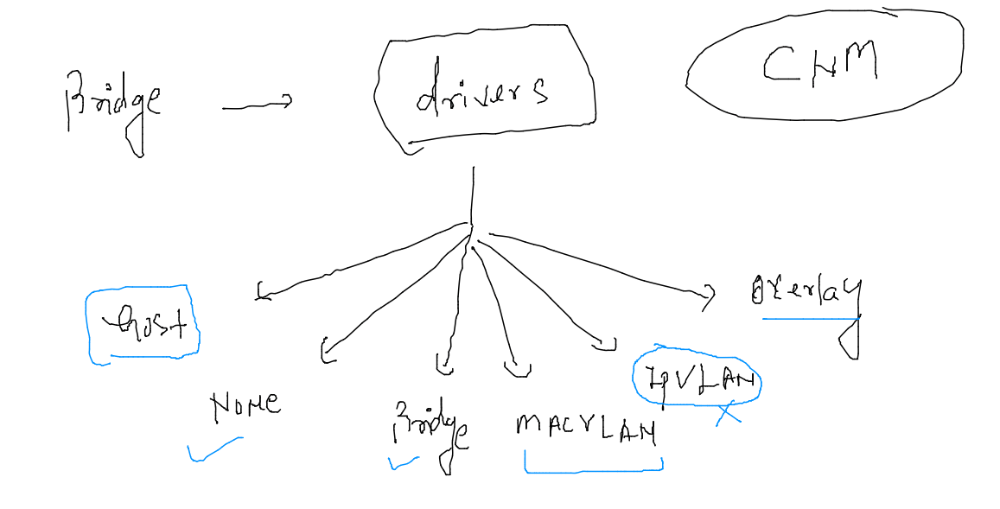
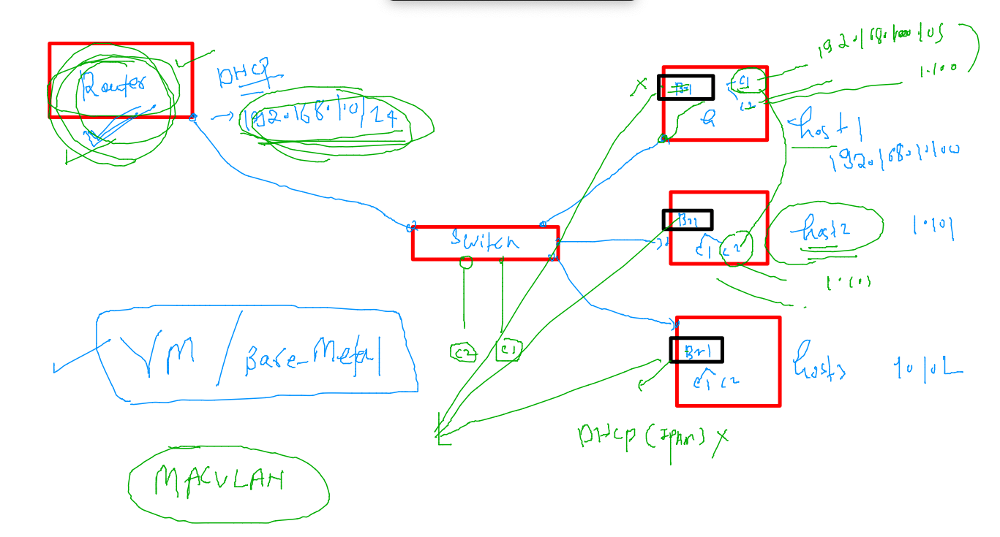
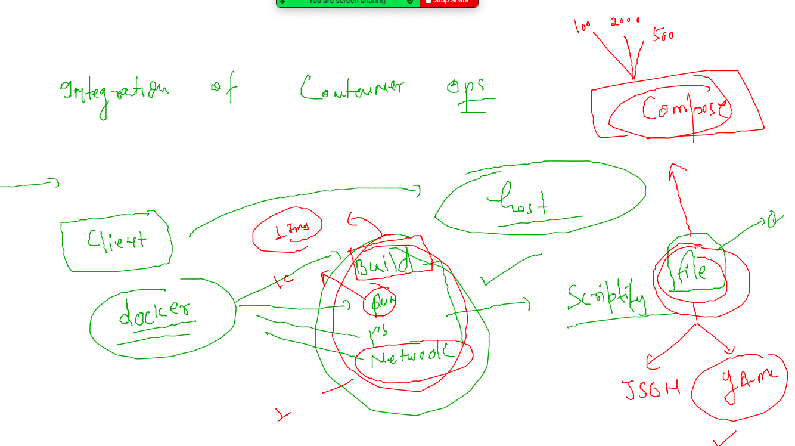

# mobileum_cna_may162022

## Session Plan :-  


### AUTOmation using jenkins [CI|CD]


## COntainer networking 

### networking modesl 


### Docker bridge 


### default offering by docker in terms of networking 

```
docker  network   ls
NETWORK ID     NAME      DRIVER    SCOPE
292213702b4e   bridge    bridge    local
1c268364e90f   host      host      local
c6ccda1f2c68   none      null      local
[ashu@ip-172-31-31-222 ~]$ 
[ashu@ip-172-31-31-222 ~]$ 
[ashu@ip-172-31-31-222 ~]$ docker  network  inspect  bridge 
[
    {
        "Name": "bridge",
        "Id": "292213702b4e4af3f68d173c88a91f4ae8c073ce6c9d0362034bae67627d31fb",
        "Created": "2022-05-18T08:14:14.48866762Z",
        "Scope": "local",
        "Driver": "bridge",
        "EnableIPv6": false,
        "IPAM": {
            "Driver": "default",
            "Options": null,
            "Config": [
                {
                    "Subnet": "172.17.0.0/16",
                    "Gateway": "172.17.0.1"

```

### all containers by default fall in default bridge for network purpose 


### creating container and check IP address 

```
docker  run  -itd  --name  ashuc1  ashuwebapp:v001
2728474cbf22b0e09cbcf5b87d84d9ee74f32801c3c686ba05d77ae23bc8bf4b
[ashu@ip-172-31-31-222 ~]$ docker  ps
CONTAINER ID   IMAGE             COMMAND                  CREATED          STATUS          PORTS     NAMES
2728474cbf22   ashuwebapp:v001   "/docker-entrypoint.…"   14 seconds ago   Up 12 seconds   80/tcp    ashuc1
[ashu@ip-172-31-31-222 ~]$ 


```

###

```
docker  inspect  ashuc1  --format='{{.NetworkSettings.IPAddress}}'
172.17.0.2

```

### container in the same bridge can by default communicate to each others

```
 
[ashu@ip-172-31-31-222 ~]$ docker  exec -it testc1 sh 
/ # 
/ # ping  172.17.0.19
PING 172.17.0.19 (172.17.0.19): 56 data bytes
64 bytes from 172.17.0.19: seq=0 ttl=64 time=0.202 ms
64 bytes from 172.17.0.19: seq=1 ttl=64 time=0.081 ms
^C
--- 172.17.0.19 ping statistics ---

```
### NAT rule is default settting using iptables with docker bridge 


### to expose container apps outside docker host we need to use linux routing table using port forwarding concept 


### problem with default docker bridge 


### creating custom docker bridges 

```
docker  network  create   ashubr1 
f17676801f398f411ec5b1c604264a114afb41d7e24935f6604b2bbdb661ce68
[ashu@ip-172-31-31-222 ~]$ docker  network  create   ashubr2  --subnet  192.168.1.0/24  --gateway  192.168.1.1 
bc77949314e14f51074ab736539c41a01ee53acfa34c440bf6910ffed1fd0b7f
[ashu@ip-172-31-31-222 ~]$ docker  network ls
NETWORK ID     NAME         DRIVER    SCOPE
05de29584d29   alexbr1      bridge    local
c755f2f51fb2   alexbr2      bridge    local
f17676801f39   ashubr1      bridge    local
bc77949314e1   ashubr2      bridge    local
```

### more bridge concpet 


### docker networking solutions

```
 497  docker  run -itd --name  ashucc11 --network  none  oraclelinux:8.4  
  498  docker  exec -it  ashucc11 bash 
  499  docker  rm  ashucc11 -f
  500  docker  network  ls
  501  docker network create  ashubrx1  
  502  docker network create  ashubrx2 --subnet  192.168.1.0/24   
  503  docker network ls
  504  docker  run -itd --name ashubrx1c1  --network ashubrx1  alpine 
  505  docker  run -itd --name ashubrx1c2  --network ashubrx1  alpine 
  506  docker  run -itd --name ashubrx2c1  --network ashubrx2   alpine 
  507  docker  run -itd --name ashubrx2c2  --network ashubrx2  --ip 192.168.1.100  alpine 
  508  docker  exec ashubrx2c2 ifconfig 
  509  docker  exec -it  ashubrx2c2 sh 
  510  docker  exec -it  ashubrx1c1 sh 
  511  history 
  512  docker  exec -it  ashubrx1c1 sh 
  513  docker  network connect  ashubrx2  ashubrx1c1 
  514  docker  exec -it  ashubrx1c1 sh 
  515  docker  network disconnect  ashubrx2  ashubrx1c1 
  516  docker  exec -it  ashubrx1c1 sh 

```

### Docker Networking bridge Drivers 


### MACVLAN driver 



### Docker Compose 


### COmpose installation link (COmpose is a docker client side software )

[Docker_compose](https://docs.docker.com/compose/install/)

### Example 1 

```
 cat  docker-compose.yaml 
version: '3.8' # this is compose file version
services:
 ashuapp1: # name of app
  image: alpine
  container_name: ashuc1
  command: ping localhost
  restart: always
[ashu@ip-172-31-31-222 ashu_scripts]$ ls
docker-compose.yaml
[ashu@ip-172-31-31-222 ashu_scripts]$ docker-compose up  -d 
[+] Running 2/2
 ⠿ Network ashu_scripts_default  Created                                                                                0.1s
 ⠿ Container ashuc1              Started                                                                                1.1s
[ashu@ip-172-31-31-222 ashu_scripts]$ docker-compose ps
NAME                COMMAND             SERVICE             STATUS              PORTS
ashuc1              "ping localhost"    ashuapp1            running             
[ashu@ip-172-31-31-222 ashu_scripts]$ 

```

### more compose OPerations 

```
 docker-compose ps
NAME                COMMAND             SERVICE             STATUS              PORTS
ashuc1              "ping localhost"    ashuapp1            running             
[ashu@ip-172-31-31-222 ashu_scripts]$ ls
docker-compose.yaml
[ashu@ip-172-31-31-222 ashu_scripts]$ docker-compose  stop 
[+] Running 1/1
 ⠿ Container ashuc1  Stopped                                                                                           10.2s
[ashu@ip-172-31-31-222 ashu_scripts]$ docker-compose ps
NAME                COMMAND             SERVICE             STATUS              PORTS
ashuc1              "ping localhost"    ashuapp1            exited (137)        
[ashu@ip-172-31-31-222 ashu_scripts]$ docker-compose start
[+] Running 1/1
 ⠿ Container ashuc1  Started                                                                                            0.8s
[ashu@ip-172-31-31-222 ashu_scripts]$ docker-compose ps
NAME                COMMAND             SERVICE             STATUS              PORTS
ashuc1              "ping localhost"    ashuapp1            running             
[ashu@ip-172-31-31-222 ashu_scripts]$ docker-compose  kill
[+] Running 1/1
 ⠿ Container ashuc1  Killed                                                                                             0.2s
[ashu@ip-172-31-31-222 ashu_scripts]$ docker-compose start
[+] Running 1/1
 ⠿ Container ashuc1  Started                                                                                            1.0s
[ashu@ip-172-31-31-222 ashu_scripts]$ docker-compose ps
NAME                COMMAND             SERVICE             STATUS              PORTS
ashuc1              "ping localhost"    ashuapp1            running             

```

### cleanup things created by compose use down 

```
docker-compose down 
[+] Running 2/2
 ⠿ Container ashuc1              Removed                                                                               10.3s
 ⠿ Network ashu_scripts_default  Removed  
 
```
### example 2 of compose file 

```
cat  multi_app.yaml 
version: '3.8' # this is compose file version
services:
 ashuapp2: # second app 
  image: ashuwebapp:v001
  container_name: ashuc2
  restart: always
  ports: # port forwarding 
  - 1234:80 
 ashuapp1: # name of app
  image: alpine
  container_name: ashuc1
  command: ping localhost
  restart: always 

```

### running file 

```
docker-compose -f  multi_app.yaml  up  -d
[+] Running 3/3
 ⠿ Network ashu_scripts_default  Created                                                                                0.1s
 ⠿ Container ashuc1              Started                                                                                1.3s
 ⠿ Container ashuc2              Started                                                                                1.2s
[ashu@ip-172-31-31-222 ashu_scripts]$ docker-compose -f  multi_app.yaml  ps
NAME                COMMAND                  SERVICE             STATUS              PORTS
ashuc1              "ping localhost"         ashuapp1            running             
ashuc2              "/docker-entrypoint.…"   ashuapp2            running             0.0.0.0:1234->80/tcp, :::1234->80/tcp
[ashu@ip-172-31-31-222 ashu_scripts]$ docker-compose -f  multi_app.yaml  images
Container           Repository          Tag                 Image Id            Size
ashuc1              alpine              latest              0ac33e5f5afa        5.57MB
ashuc2              ashuwebapp          v001                716af69008db        142MB
[ashu@ip-172-31-31-222 ashu_scripts]$ 

```
### compose operations 

```
docker-compose -f  multi_app.yaml  ps
NAME                COMMAND                  SERVICE             STATUS              PORTS
ashuc1              "ping localhost"         ashuapp1            running             
ashuc2              "/docker-entrypoint.…"   ashuapp2            running             0.0.0.0:1234->80/tcp, :::1234->80/tcp
[ashu@ip-172-31-31-222 ashu_scripts]$ docker-compose -f  multi_app.yaml  stop ashuapp1 
[+] Running 1/1
 ⠿ Container ashuc1  Stopped                                                                                           10.5s
[ashu@ip-172-31-31-222 ashu_scripts]$ docker-compose -f  multi_app.yaml  ps
NAME                COMMAND                  SERVICE             STATUS              PORTS
ashuc1              "ping localhost"         ashuapp1            exited (137)        
ashuc2              "/docker-entrypoint.…"   ashuapp2            running             0.0.0.0:1234->80/tcp, :::1234->80/tcp
[ashu@ip-172-31-31-222 ashu_scripts]$ docker-compose -f  multi_app.yaml  start  ashuapp1 
[+] Running 1/1
 ⠿ Container ashuc1  Started                                                                                            0.8s
[ashu@ip-172-31-31-222 ashu_scripts]$ docker-compose ps
NAME                COMMAND                  SERVICE             STATUS              PORTS
ashuc1              "ping localhost"         ashuapp1            running             
ashuc2              "/docker-entrypoint.…"   ashuapp2            running             0.0.0.0:1234->80/tcp, :::1234->80/tcp
[ashu@ip-172-31-31-222 ashu_scripts]$ 

```


