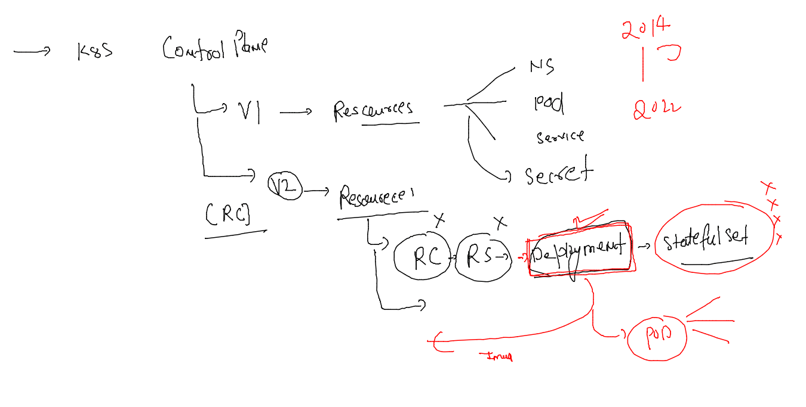

# mobileum_cna_may162022

## Session Plan :-  


## Recreating namespace and setting it as default 

```
kubectl get  ns
NAME              STATUS   AGE
default           Active   20m
kube-node-lease   Active   20m
kube-public       Active   20m
kube-system       Active   20m
[ashu@client-machine ~]$ kubectl create  ns  ashu-space 
namespace/ashu-space created
[ashu@client-machine ~]$ kubectl get ns
NAME              STATUS   AGE
ashu-space        Active   4s
default           Active   20m
kube-node-lease   Active   20m
kube-public       Active   20m
kube-system       Active   20m
[ashu@client-machine ~]$ kubectl get po
No resources found in default namespace.
[ashu@client-machine ~]$ kubectl config set-context --current --namespace=ashu-space
Context "kubernetes-admin@kubernetes" modified.
[ashu@client-machine ~]$ 


```

### checking current namespace 

```
kubectl  config get-contexts 
CURRENT   NAME                          CLUSTER      AUTHINFO           NAMESPACE
*         kubernetes-admin@kubernetes   kubernetes   kubernetes-admin   ashu-space
```

### Understanding problems with POD 


### Intro to controllers in k8s 


### nativ to k8s kube-system namespace 

```
kubectl  get  pods  -n kube-system 
NAME                                       READY   STATUS    RESTARTS   AGE
calico-kube-controllers-56cdb7c587-gt7dh   1/1     Running   0          52m
calico-node-44lpz                          1/1     Running   0          52m
calico-node-9vtdj                          1/1     Running   0          52m
calico-node-fhfz8                          1/1     Running   0          52m
coredns-6d4b75cb6d-fs7hz                   1/1     Running   0          53m
coredns-6d4b75cb6d-xmwlp                   1/1     Running   0          53m
etcd-control-plane                         1/1     Running   0          53m
kube-apiserver-control-plane               1/1     Running   0          53m
kube-controller-manager-control-plane      1/1     Running   0          53m
kube-proxy-28ltf                           1/1     Running   0          52m
kube-proxy-vtz2p                           1/1     Running   0          52m
kube-proxy-z527m                           1/1     Running   0          53m
kube-scheduler-control-plane               1/1     Running   0          53m

```

### deployment Resource type to create POds with features like scaling / recreation 



### 

```
 kubectl create -f  deployment1.yaml 
deployment.apps/ashuapp1 created
[ashu@client-machine ~]$ kubectl  get  deployments 
NAME       READY   UP-TO-DATE   AVAILABLE   AGE
ashuapp1   1/1     1            1           6s
[ashu@client-machine ~]$ kubectl get  po
NAME                        READY   STATUS    RESTARTS   AGE
ashuapp1-569f58ddbb-krrpq   1/1     Running   0          13s
[ashu@client-machine ~]$ 


```

### pod recreation will happen if we / someone delete pod 

```
kubectl create -f  deployment1.yaml 
deployment.apps/ashuapp1 created
[ashu@client-machine ~]$ kubectl  get  deployments 
NAME       READY   UP-TO-DATE   AVAILABLE   AGE
ashuapp1   1/1     1            1           6s
[ashu@client-machine ~]$ kubectl get  po
NAME                        READY   STATUS    RESTARTS   AGE
ashuapp1-569f58ddbb-krrpq   1/1     Running   0          13s
[ashu@client-machine ~]$ kubectl get  po -owide
NAME                        READY   STATUS    RESTARTS   AGE     IP              NODE    NOMINATED NODE   READINESS GATES
ashuapp1-569f58ddbb-krrpq   1/1     Running   0          2m22s   192.168.104.5   node2   <none>           <none>
[ashu@client-machine ~]$ kubectl  delete pod  ashuapp1-569f58ddbb-krrpq
pod "ashuapp1-569f58ddbb-krrpq" deleted
[ashu@client-machine ~]$ kubectl get  po -owide
NAME                        READY   STATUS    RESTARTS   AGE   IP                NODE    NOMINATED NODE   READINESS GATES
ashuapp1-569f58ddbb-nb7rq   1/1     Running   0          3s    192.168.166.140   node1   <none>           <none>
[ashu@client-machine ~]$ 


```

### pod scaling understanding 


### manual scaling of pod using deployment 

```
kubectl get  deploy 
NAME       READY   UP-TO-DATE   AVAILABLE   AGE
ashuapp1   1/1     1            1           15m
[ashu@client-machine ~]$ kubectl get  po
NAME                        READY   STATUS    RESTARTS   AGE
ashuapp1-569f58ddbb-nb7rq   1/1     Running   0          12m
[ashu@client-machine ~]$ 
[ashu@client-machine ~]$ kubectl scale  deploy  ashuapp1  --replicas=3
deployment.apps/ashuapp1 scaled
[ashu@client-machine ~]$ =
-bash: =: command not found
[ashu@client-machine ~]$ kubectl get  deploy 
NAME       READY   UP-TO-DATE   AVAILABLE   AGE
ashuapp1   3/3     3            3           15m
[ashu@client-machine ~]$ kubectl get  po 
NAME                        READY   STATUS    RESTARTS   AGE
ashuapp1-569f58ddbb-8mm65   1/1     Running   0          23s
ashuapp1-569f58ddbb-ch4zq   1/1     Running   0          23s
ashuapp1-569f58ddbb-nb7rq   1/1     Running   0          13m
[ashu@client-machine ~]$ kubectl get  po  -owide
NAME                        READY   STATUS    RESTARTS   AGE   IP                NODE    NOMINATED NODE   READINESS GATES
ashuapp1-569f58ddbb-8mm65   1/1     Running   0          58s   192.168.104.29    node2   <none>           <none>
ashuapp1-569f58ddbb-ch4zq   1/1     Running   0          58s   192.168.104.30    node2   <none>           <none>
ashuapp1-569f58ddbb-nb7rq   1/1     Running   0          13m   192.168.166.140   node1   <none>           <none>
[ashu@client-machine ~]$ 

```

### scaling pod using yaml also 

```
kubectl apply -f deployment1.yaml 
Warning: resource deployments/ashuapp1 is missing the kubectl.kubernetes.io/last-applied-configuration annotation which is required by kubectl apply. kubectl apply should only be used on resources created declaratively by either kubectl create --save-config or kubectl apply. The missing annotation will be patched automatically.
deployment.apps/ashuapp1 configured
[ashu@client-machine ~]$ 
[ashu@client-machine ~]$ 
[ashu@client-machine ~]$ kubectl get  po  -owide
NAME                        READY   STATUS    RESTARTS   AGE     IP                NODE    NOMINATED NODE   READINESS GATES
ashuapp1-569f58ddbb-8mm65   1/1     Running   0          2m14s   192.168.104.29    node2   <none>           <none>
ashuapp1-569f58ddbb-92vfn   1/1     Running   0          6s      192.168.166.158   node1   <none>           <none>
ashuapp1-569f58ddbb-ch4zq   1/1     Running   0          2m14s   192.168.104.30    node2   <none>           <none>
ashuapp1-569f58ddbb-nb7rq   1/1     Running   0          15m     192.168.166.140   node1   <none>           <none>
[ashu@client-machine ~]$ 

```


