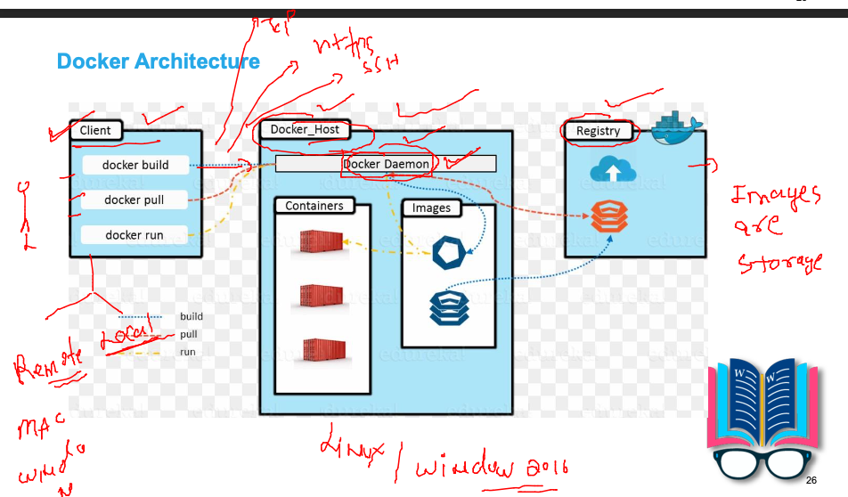
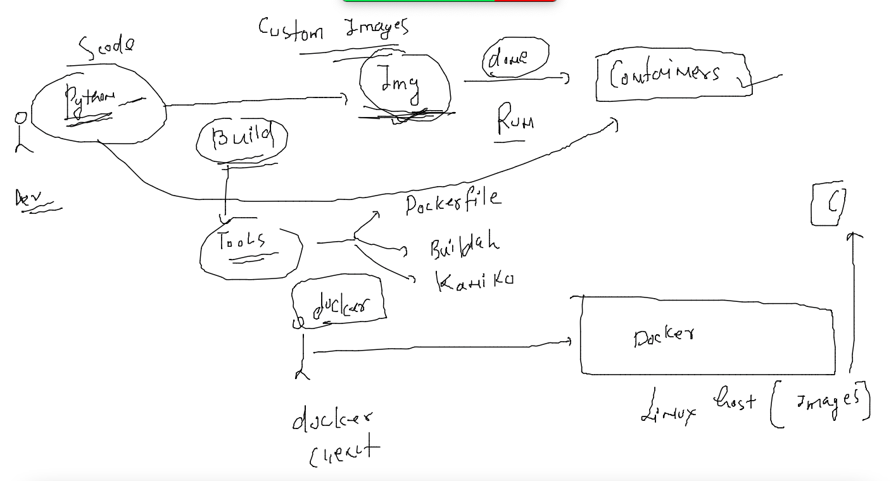

# mobileum_cna_may162022

## Session Plan :-  


### app deployment probelms in History 


### problem with VM 


### OS understanding 


### Introduction to containers 


### VM vs containers 


### Docker as container  platform 


### Docker installation on Host cloud 

```
 7  for  i  in  ashu  alex arpita atri mota dave david deepa lepipas  rosas indrajeet lopes lam   malli matt neha nikos nitin pradeep sanaya shah bruce  steven tsaimos ; do useradd $i; echo "Docker@099#"  |  passwd $i --stdin ; done
    8  vim /etc/ssh/sshd_config 
    9  systemctl restart sshd
   10  history 
   11  yum  install  docker -y
   12  systemctl start docker
   13  systemctl status docker
   14  systemctl enable  docker
```

### Non root users can't use docker access 

```
[ashu@ip-172-31-31-222 ~]$ whoami
ashu
[ashu@ip-172-31-31-222 ~]$ docker  version 
Client:
 Version:           20.10.13
 API version:       1.41
 Go version:        go1.16.15
 Git commit:        a224086
 Built:             Thu Mar 31 19:20:32 2022
 OS/Arch:           linux/amd64
 Context:           default
 Experimental:      true
Got permission denied while trying to connect to the Docker daemon socket at unix:///var/run/docker.sock: Get "http://%2Fvar%2Frun%2Fdocker.sock/v1.24/version": dial unix /var/run/docker.sock: connect: permission denied
```

### solution -- ON the docker server side 

```
 for  i  in  ashu  alex arpita atri mota dave david deepa lepipas  rosas indrajeet lopes lam   malli matt neha nikos nitin pradeep sanaya shah bruce  steven tsaimos 
> do
> usermod -aG docker  $i 
> done
[root@ip-172-31-31-222 ~]# 
[root@ip-172-31-31-222 ~]# 
[root@ip-172-31-31-222 ~]# grep -i docker  /etc/group
docker:x:992:ashu,alex,arpita,atri,mota,dave,david,deepa,lepipas,rosas,indrajeet,lopes,lam,malli,matt,neha,nikos,nitin,pradeep,sanaya,shah,bruce,steven,tsaimos
[root@ip-172-31-31-222 ~]# 
[root@ip-172-31-31-222 ~]# 
[root@ip-172-31-31-222 ~]# usermod -a -G  docker  ec2-user
[root@ip-172-31-31-222 ~]# 


```

### reconnection 

```
 docker  -v
Docker version 20.10.13, build a224086
[ashu@ip-172-31-31-222 ~]$ docker  version 
Client:
 Version:           20.10.13
 API version:       1.41
 Go version:        go1.16.15
 Git commit:        a224086
 Built:             Thu Mar 31 19:20:32 2022
 OS/Arch:           linux/amd64
 Context:           default
 Experimental:      true

Server:
 Engine:
  Version:          20.10.13
  API version:      1.41 (minimum version 1.12)
  Go version:       go1.16.15
  Git commit:       906f57f

```

### Docker. architecture 



## creating containers like VMs

### Container images --


### searching imgaes on docker hub 

```
docker  search  java
NAME                                 DESCRIPTION                                     STARS     OFFICIAL   AUTOMATED
node                                 Node.js is a JavaScript-based platform for s…   11457     [OK]       
tomcat                               Apache Tomcat is an open source implementati…   3319      [OK]       
openjdk                              "Vanilla" builds of OpenJDK (an open-source …   3278      [OK]       
java                                 DEPRECATED; use "openjdk" (or other JDK impl…   1976      [OK]       
ghost                                Ghost is a free and open source blogging pla…   1503      [OK]       
couchdb                              CouchDB is a database that uses JSON for doc…   474       [OK]       
jetty                                Jetty provides a Web server and javax.servle…   384       [OK]       
amazoncorretto                       Corretto is a no-cost, production-ready dist…   205       [OK]       
circleci/node                        Node.js is a JavaScript-based platform for s…   128                  
groovy                               Apache Groovy is a multi-faceted language fo…   127       [OK]       
ibmjava                              Off
```

### pulling images from docker hub to docker host -- using docker client 

```
  19  docker  pull alpine 
   20  docker  pull openjdk 
   21  history 
   22  docker images
   23  docker pull mysql
   24  docker pull postgres
   25  history 
   26  docker  images
   27  docker pull python:3.7-buster
   28  docker  images
   29  docker pull python
   30  history 
[ashu@ip-172-31-31-222 ~]$ docker  images
REPOSITORY   TAG          IMAGE ID       CREATED        SIZE
postgres     latest       9dbc24674f25   4 days ago     376MB
python       3.7-buster   9e9a1e177aed   5 days ago     880MB
python       latest       bda19bf988a7   5 days ago     919MB
mysql        latest       76152be68449   5 days ago     524MB
openjdk      latest       5e28ba2b4cdb   2 weeks ago    471MB
alpine       latest       0ac33e5f5afa   5 weeks ago    5.57MB
centos       latest       5d0da3dc9764   8 months ago   231MB
```
### Container creation 


### creating first container 


### creating and list running containers 

```
 docker  run  --name  ashuc1  -d   alpine:latest      ping  localhost 
46c18bce43926636dd1750dc36cf5a91520a04d9a343bfb5a344d29465acd396
[ashu@ip-172-31-31-222 ~]$ docker  ps
CONTAINER ID   IMAGE           COMMAND            CREATED          STATUS          PORTS     NAMES
3e49aac417f9   alpine:latest   "ping localhost"   38 seconds ago   Up 37 seconds             mattc1
47d554121e61   alpine:latest   "ping localhost"   45 seconds ago   Up 44 seconds             rosasc1
46c18bce4392   alpine:latest   "ping localhost"   51 seconds ago   Up 50 seconds             ashuc1
```

### checking output of programe running inside a container 

```
docker logs  ashuc1
PING localhost (127.0.0.1): 56 data bytes
64 bytes from 127.0.0.1: seq=0 ttl=64 time=0.044 ms
64 bytes from 127.0.0.1: seq=1 ttl=64 time=0.046 ms
64 bytes from 127.0.0.1: seq=2 ttl=64 time=0.054 ms
64 bytes from 127.0.0.1: seq=3 ttl=64 time=0.050 ms
64 bytes from 127.0.0.1: seq=4 ttl=64 time=0.055 ms
64 bytes from 127.0.0.1: seq=5 ttl=6
```

### check container resource consumption 

```
 docker  stats    ashuc1  
 CONTAINER ID   NAME      CPU %     MEM USAGE / LIMIT   MEM %     NET I/O       BLOCK I/O   PIDS
46c18bce4392   ashuc1    0.01%     280KiB / 15.44GiB   0.00%     1.07kB / 0B   0B / 0B     1
^C

```

### stop running containers 

```
docker  stop   ashuc1
```

### starting the same container 

```
docker  start  ashuc1
ashuc1

```

### access shell of a running container 

```
[ashu@ip-172-31-31-222 ~]$ cat  /etc/os-release 
NAME="Amazon Linux"
VERSION="2"
ID="amzn"
ID_LIKE="centos rhel fedora"
VERSION_ID="2"
PRETTY_NAME="Amazon Linux 2"
ANSI_COLOR="0;33"
CPE_NAME="cpe:2.3:o:amazon:amazon_linux:2"
HOME_URL="https://amazonlinux.com/"
[ashu@ip-172-31-31-222 ~]$ uname -r
5.10.109-104.500.amzn2.x86_64
[ashu@ip-172-31-31-222 ~]$ 
[ashu@ip-172-31-31-222 ~]$ 
[ashu@ip-172-31-31-222 ~]$ docker  exec  -it  ashuc1   sh 
/ # 
/ # uname  -r 
5.10.109-104.500.amzn2.x86_64
/ # cat /etc/os-release 
NAME="Alpine Linux"
ID=alpine
VERSION_ID=3.15.4
PRETTY_NAME="Alpine Linux v3.15"
HOME_URL="https://alpinelinux.org/"
BUG_REPORT_URL="https://bugs.alpinelinux.org/"
/ # exit

```
### solution 1 

```
[ashu@ip-172-31-31-222 ~]$ docker  run -d  --name ashuc1  alpine  ping localhost 
2ad27f97cf2ce1e34549b944e932eac95378cffccd402109f2fd12eb0a857e7c
[ashu@ip-172-31-31-222 ~]$ 
[ashu@ip-172-31-31-222 ~]$ 
[ashu@ip-172-31-31-222 ~]$ docker  run -d  --name ashuc2  alpine  ping localhost 
84519679d668ef6c3fd95ca8cdd961d8bc472f4a89d7e708e3c2e4c2d598dbd7
[ashu@ip-172-31-31-222 ~]$ docker exec -it ashuc1  sh 
/ # 
/ # 
/ # pwd
/
/ # ls
bin    dev    etc    home   lib    media  mnt    opt    proc   root   run    sbin   srv    sys    tmp    usr    var
/ # echo  ashutoshh   >helloc1.txt 
/ # ls
bin          etc          home         media        opt          root         sbin         sys          usr
dev          helloc1.txt  lib          mnt          proc         run          srv          tmp          var
/ # cat  helloc1.txt 
ashutoshh
/ # exit
[ashu@ip-172-31-31-222 ~]$ docker  cp  ashuc1:/helloc1.txt  . 
[ashu@ip-172-31-31-222 ~]$ ls
helloc1.txt
[ashu@ip-172-31-31-222 ~]$ docker  cp helloc1.txt  ashuc2:/
```
### application containerization -- source code -- docker image - docker containers 




