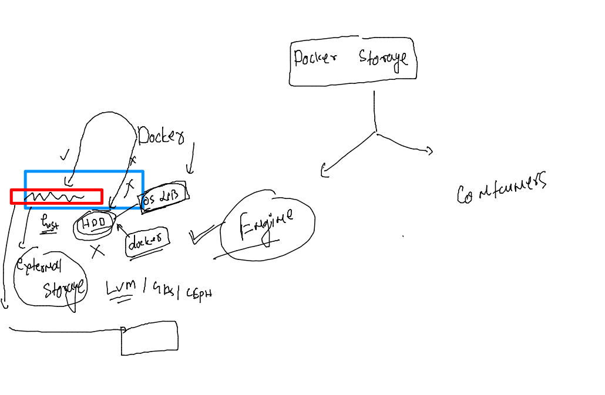

# mobileum_cna_may162022

## Session Plan :-  


### Understanding docker client and docker host 

### context concept in Docker client side

```
docker context  ls
NAME        DESCRIPTION                               DOCKER ENDPOINT               KUBERNETES ENDPOINT   ORCHESTRATOR
default *   Current DOCKER_HOST based configuration   unix:///var/run/docker.sock                         swarm
root@docker-client:~# 
root@docker-client:~# 
root@docker-client:~# docker context  create  docker-host1  --docker   host="ssh://ashu@172.31.31.222"
docker-host1
Successfully created context "docker-host1"
root@docker-client:~# 
root@docker-client:~# 
root@docker-client:~# 
root@docker-client:~# docker context  ls
NAME           DESCRIPTION                               DOCKER ENDPOINT               KUBERNETES ENDPOINT   ORCHESTRATOR
default *      Current DOCKER_HOST based configuration   unix:///var/run/docker.sock                         swarm
docker-host1                                             ssh://ashu@172.31.31.222                            
root@docker-client:~# 
root@docker-client:~# 
root@docker-client:~# docker  context use  docker-host1
docker-host1
Current context is now "docker-host1"
root@docker-client:~# docker context  ls
NAME             DESCRIPTION                               DOCKER ENDPOINT               KUBERNETES ENDPOINT   ORCHESTRATOR
default          Current DOCKER_HOST based configuration   unix:///var/run/docker.sock                         swarm
docker-host1 *                                             ssh://ashu@172.31.31.222

```

### example of context 

```
docker context  ls
NAME             DESCRIPTION                               DOCKER ENDPOINT               KUBERNETES ENDPOINT   ORCHESTRATOR
default          Current DOCKER_HOST based configuration   unix:///var/run/docker.sock                         swarm
docker-host1 *                                             ssh://ashu@172.31.31.222                            
root@docker-client:~# docker  context use default
default
Current context is now "default"
root@docker-client:~# docker context  ls
NAME           DESCRIPTION                               DOCKER ENDPOINT               KUBERNETES ENDPOINT   ORCHESTRATOR
default *      Current DOCKER_HOST based configuration   unix:///var/run/docker.sock                         swarm
docker-host1                                             ssh://ashu@172.31.31.222                            
root@docker-client:~# docker  images
REPOSITORY   TAG       IMAGE ID       CREATED        SIZE
final        v1        bf7c812208aa   42 hours ago   1.23GB
ubuntu       ashu      8f6fb41ddcfe   42 hours ago   2.21MB
focal        latest    217fe04a1fda   43 hours ago   322MB
ubuntu       latest    d2e4e1f51132   2 weeks ago    77.8MB
root@docker-client:~# docker context  use docker-host1
docker-host1
Current context is now "docker-host1"
root@docker-client:~# docker  images
REPOSITORY       TAG       IMAGE ID       CREATED        SIZE
atriwebapp123    v001      a6ff19c963b8   17 hours ago   142MB
indrawebapp      v0011     a250ddd1d553   17 hours ago   142MB
motawebapp       v001      3a4c75bb6ad6   17 hours ago   142MB
motawebapp       v0011     3a4c75bb6ad6   17 hours ago   142MB
mattwebapp       2.0       91fb8196b26d   17 hours ago   142MB
```
### a customer story app


### customer app building 

```
docker  build  -t  docker.io/dockerashu/customerapp:ashuv1 .  
Sending build context to Docker daemon  3.958MB
Step 1/11 : FROM oraclelinux:8.4
8.4: Pulling from library/oraclelinux
a4df6f21af84: Already exists 
Digest: sha256:b81d5b0638bb67030b207d28586d0e714a811cc612396dbe3410db406998b3ad
Status: Downloaded newer image for oraclelinux:8.4
 ---> 97e22ab49eea
Step 2/11 : LABEL name="ashutoshh"
 ---> Running in b828568a8306
Removing intermediate container b828568a8306
 ---> 22f6919fc48c
Step 3/11 : ENV deploy=sampleapp
 ---> Running in 5b438be6a3c3
Removing intermediate container 5b438be6a3c3
 ---> 122c1911ae09
Step 4/11 : RUN yum install httpd -y && mkdir -p /customer/{app1,app2,app3}
 ---> Running in 72834f7a4c28
Oracle Linux 8 BaseOS Latest (x86_64)            94 MB/s |  46 MB     00:00    
Oracle Linux 8 Application Stream (x86_64)      150 MB/s |  36 MB     00:00    
Last metadata expiration check: 0:00:09 ago on Thu May 19 08:50:51 2022.
Dependencies resolved.
====================================================================================================
 Package              Arch    Version                                       Repository          Size
====================================================================================================
Installing:
 httpd                x86_64  2.4.37-47.0.1.module+el8.6.0+20649+083145da.1 ol8_appstream      1.4 M
Installing dependencies:
 apr                  x86_64  1.6.3-12.el8                                  ol8_appstream      129 k
 apr-util             x86_64  1.6.1-6.el8                                   ol8_appstream      105 k
 httpd-filesystem     noarch  2.4.37-47.0.1.module+el8.6.0+20649+083145da.1 ol8_appstream       41 k
 httpd-tools          x86_64  2.4.37-47.0.1.module+el8.6.0+20649+083145da.1 ol8_appstream      108 k
 mailcap              noarch  2.1.48-3.el8                                  ol8_baseos_latest   39 k
 mod_http2            x86_64  1.15.7-5.module+el8.6.0+20548+01710940        ol8_appstream      154 k
 oracle-logos-httpd   noarch  84.5-1.0.1.el8                                ol8_baseos_latest   29 k
Enabling module streams:
 httpd                        2.4                                                                   

Transaction Summary
====================================================================================================
Install  8 Packages

Total download size: 2.0 M
Installed size: 5.4 M
Downloading Packages:
(1/8): mailcap-2.1.48-3.el8.noarch.rpm          375 kB/s |  39 kB     00:00    
(2/8): oracle-logos-httpd-84.5-1.0.1.el8.noarch 257 kB/s |  29 kB     00:00    
(3/8): apr-util-1.6.1-6.el8.x86_64.rpm          5.8 MB/s | 105 kB     00:00    
(4/8): apr-1.6.3-12.el8.x86_64.rpm              1.0 MB/s | 129 kB     00:00    
(5/8): httpd-filesystem-2.4.37-47.0.1.module+el  13 MB/s |  41 kB     00:00    
(6/8): httpd-tools-2.4.37-47.0.1.module+el8.6.0  29 MB/s | 108 kB     00:00    
(7/8): mod_http2-1.15.7-5.module+el8.6.0+20548+  37 MB/s | 154 kB     00:00    
(8/8): httpd-2.4.37-47.0.1.module+el8.6.0+20649  33 MB/s | 1.4 MB     00:00    
--------------------------------------------------------------------------------
Total                                            12 MB/s | 2.0 MB     00:00     
Running transaction check
Transaction check succeeded.
Running transaction test
Transaction test succeeded.
Running transaction
  Preparing        :                                                        1/1 
  Installing       : apr-1.6.3-12.el8.x86_64                                1/8 
  Running scriptlet: apr-1.6.3-12.el8.x86_64                                1/8 
  Installing       : apr-util-1.6.1-6.el8.x86_64                            2/8 
  Running scriptlet: apr-util-1.6.1-6.el8.x86_64                            2/8 
  Installing       : httpd-tools-2.4.37-47.0.1.module+el8.6.0+20649+08314   3/8 
  Running scriptlet: httpd-filesystem-2.4.37-47.0.1.module+el8.6.0+20649+   4/8 
  Installing       : httpd-filesystem-2.4.37-47.0.1.module+el8.6.0+20649+   4/8 
  Installing       : oracle-logos-httpd-84.5-1.0.1.el8.noarch               5/8 
  Installing       : mailcap-2.1.48-3.el8.noarch                            6/8 
  Installing       : mod_http2-1.15.7-5.module+el8.6.0+20548+01710940.x86   7/8 
  Installing       : httpd-2.4.37-47.0.1.module+el8.6.0+20649+083145da.1.   8/8 
  Running scriptlet: httpd-2.4.37-47.0.1.module+el8.6.0+20649+083145da.1.   8/8 
  Verifying        : mailcap-2.1.48-3.el8.noarch                            1/8 
  Verifying        : oracle-logos-httpd-84.5-1.0.1.el8.noarch               2/8 
  Verifying        : apr-1.6.3-12.el8.x86_64                                3/8 
  Verifying        : apr-util-1.6.1-6.el8.x86_64                            4/8 
  Verifying        : httpd-2.4.37-47.0.1.module+el8.6.0+20649+083145da.1.   5/8 
  Verifying        : httpd-filesystem-2.4.37-47.0.1.module+el8.6.0+20649+   6/8 
  Verifying        : httpd-tools-2.4.37-47.0.1.module+el8.6.0+20649+08314   7/8 
  Verifying        : mod_http2-1.15.7-5.module+el8.6.0+20548+01710940.x86   8/8 

Installed:
  apr-1.6.3-12.el8.x86_64                                                       
  apr-util-1.6.1-6.el8.x86_64                                                   
  httpd-2.4.37-47.0.1.module+el8.6.0+20649+083145da.1.x86_64                    
  httpd-filesystem-2.4.37-47.0.1.module+el8.6.0+20649+083145da.1.noarch         
  httpd-tools-2.4.37-47.0.1.module+el8.6.0+20649+083145da.1.x86_64              
  mailcap-2.1.48-3.el8.noarch                                                   
  mod_http2-1.15.7-5.module+el8.6.0+20548+01710940.x86_64                       
  oracle-logos-httpd-84.5-1.0.1.el8.noarch                                      

Complete!
Removing intermediate container 72834f7a4c28
 ---> 52653c6f9082
Step 5/11 : COPY html-sample-app /customer/app1/
 ---> 4be7ee4a46ef
Step 6/11 : COPY project-html-website /customer/app2/
 ---> b25e5c4d9092
Step 7/11 : COPY project-website-template /customer/app3/
 ---> c488df0f3f6f
Step 8/11 : COPY deploy.sh /customer/
 ---> 50301bcaf2ca
Step 9/11 : WORKDIR /customer
 ---> Running in 529c07487c97
Removing intermediate container 529c07487c97
 ---> 793b1fd1fb9f
Step 10/11 : RUN chmod +x  deploy.sh
 ---> Running in 24101b8bc8d7
Removing intermediate container 24101b8bc8d7
 ---> 8e9549de2658
Step 11/11 : ENTRYPOINT ["./deploy.sh"]
 ---> Running in 050e909937b9
Removing intermediate container 050e909937b9
 ---> 7578da182baa
Successfully built 7578da182baa
Successfully tagged dockerashu/customerapp:ashuv1
```

### container with command image
```
 docker  run -itd --name ashut1  -p 1122:80 08c85414d033
e891abb6d456a61566fd409851fbc07fb890186546449b51dab3b52c922b0eca
[ashu@ip-172-31-31-222 customer_app]$ docker  exec  ashut1 env
PATH=/usr/local/sbin:/usr/local/bin:/usr/sbin:/usr/bin:/sbin:/bin
HOSTNAME=e891abb6d456
deploy=sampleapp
HOME=/root
[ashu@ip-172-31-31-222 customer_app]$ docker rm ashut1 -f
ashut1
[ashu@ip-172-31-31-222 customer_app]$ docker  run -itd --name ashut1  -p 1122:80 -e deploy=app3  08c85414d033
d35da8b5ab6a67ddfaa4198633b707331f7e3ff2b5779a110402ffe32bb61917
[ashu@ip-172-31-31-222 customer_app]$ docker  exec  ashut1 env
PATH=/usr/local/sbin:/usr/local/bin:/usr/sbin:/usr/bin:/sbin:/bin
HOSTNAME=d35da8b5ab6a
deploy=app3
HOME=/root
[ashu@ip-172-31-31-222 customer_app]$ docker rm ashut1 -f
ashut1
[ashu@ip-172-31-31-222 customer_app]$ docker  run -itd --name ashut1  -p 1122:80 -e deploy=app2  08c85414d033
73d376e4d15b3e9e987f448fa4dcb4aaed5cb599c5ae2ef6596defec5e89036e
[ashu@ip-172-31-31-222 customer_app]$ docker  exec  ashut1 env
PATH=/usr/local/sbin:/usr/local/bin:/usr/sbin:/usr/bin:/sbin:/bin
HOSTNAME=73d376e4d15b
deploy=app2
HOME=/root

```

## Storage in Docker 



### configure Docker storage in docker host 

[LInktoimplement](https://github.com/redashu/docker/tree/master/docker_storage)

### for data migration 

```
rsync -avp  /var/lib/docker/ /opt/docker-server/
 systemctl daemon-reload 
 systemctl restart docker
```
### COntainer storage


### MYSQL db container without storage 

```
docker  run -d  --name ashudb1  -e  MYSQL_ROOT_PASSWORD="Docker@099#" mysql
Unable to find image 'mysql:latest' locally
latest: Pulling from library/mysql
c32ce6654453: Pull complete 
415d08ee031a: Pull complete 
7a38fec2542f: Pull complete 
352881ee8fe9: Pull complete 

```

### creating db in container 

```
[ashu@ip-172-31-31-222 ~]$ docker  exec -it  ashudb1  bash
root@1b1b2e8bfdcd:/# 
root@1b1b2e8bfdcd:/# 
root@1b1b2e8bfdcd:/# mysql -u root -p
Enter password: 
Welcome to the MySQL monitor.  Commands end with ; or \g.
Your MySQL connection id is 8
Server version: 8.0.29 MySQL Community Server - GPL

Copyright (c) 2000, 2022, Oracle and/or its affiliates.

Oracle is a registered trademark of Oracle Corporation and/or its
affiliates. Other names may be trademarks of their respective
owners.

Type 'help;' or '\h' for help. Type '\c' to clear the current input statement.

mysql> show databases;
+--------------------+
| Database           |
+--------------------+
| information_schema |
| mysql              |
| performance_schema |
| sys                |
+--------------------+
4 rows in set (0.01 sec)

mysql> create  database ashudb1;
Query OK, 1 row affected (0.01 sec)

mysql> show databases;
+--------------------+
| Database           |
+--------------------+
| ashudb1            |
| information_schema |
| mysql              |
| performance_schema |
| sys                |
+--------------------+
5 rows in set (0.00 sec)


```

### Now creating container with VOlume 

```
 docker  run -d  --name ashudb1  -e  MYSQL_ROOT_PASSWORD="Docker@099#"   -v   ashuvol1:/var/lib/mysql/     mysql
bfbc717c4496dc7cfcdd30881c939d3952937fe6a4a28d098c37537a2b8f43ef
[ashu@ip-172-31-31-222 ~]$ docker logs  ashudb1
2022-05-19 10:22:29+00:00 [Note] [Entrypoint]: Entrypoint script for MySQL Server 8.0.29-1debian10 started.
2022-05-19 10:22:29+00:00 [Note] [Entrypoint]: Switching to dedicated user 'mysql'
2022-05-19 10:22:29+00:00 [Note] [Entrypoint]: Entrypoint script for MySQL Server 8.0.29-1debian10 started.
2022-05-19 10:22:29+00:00 [Note] [Entrypoint]: Initializing database files
2022-05-19T10:22:29.597789Z 0 [System] [MY-013169] [Server] /usr/sbin/mysqld (mysqld 8.0.29) initializing of server in progress as process 44
2022-05-19T10:22:29.605031Z 1 [System] [MY-013576] [InnoDB] InnoDB initialization has started.
2022-05-19T10:22:30.059486Z 1 [System] [MY-0135
```

### COntainer with volume 

```
  667  docker  run -d  --name ashudb1  -e  MYSQL_ROOT_PASSWORD="Docker@099#"   -v   ashuvol1:/var/lib/mysql/   -p 1122:3306   mysql
  668  docker  exec -it  ashudb1 bash 
  669  history 
[ashu@ip-172-31-31-222 ~]$ docker  volume  inspect  ashuvol1
[
    {
        "CreatedAt": "2022-05-19T10:31:20Z",
        "Driver": "local",
        "Labels": {},
        "Mountpoint": "/opt/docker-server/volumes/ashuvol1/_data",
        "Name": "ashuvol1",
        "Options": {},
        "Scope": "local"
    }
]

```

### sharing volume with readonly option 

```
docker  run -it --name backup -v  ashuvol1:/mnt/backup:ro  alpine sh 
/ # 
/ # 
/ # cd /mnt/backup/
/mnt/backup # ls
#ib_16384_0.dblwr   binlog.000002       ca.pem              ib_logfile1         performance_schema  sys
#ib_16384_1.dblwr   binlog.000003       client-cert.pem     ibdata1             private_key.pem     test1
#innodb_temp        binlog.000004       client-key.pem      ibtmp1              public_key.pem      undo_001
auto.cnf            binlog.index        ib_buffer_pool      mysql               server-cert.pem     undo_002
binlog.000001       ca-key.pem          ib_logfile0         mysql.ibd           server-key.pem
/mnt/backup # rm ca.pem 
rm: remove 'ca.pem'? y
rm: can't remove 'ca.pem': Read-only file system
/mnt/backup # exit

```


### VOlume mounting 

```
docker  run -it --name backup -v  ashuvol1:/mnt/backup:ro  alpine sh 
/ # 
/ # 
/ # cd /mnt/backup/
/mnt/backup # ls
#ib_16384_0.dblwr   binlog.000002       ca.pem              ib_logfile1         performance_schema  sys
#ib_16384_1.dblwr   binlog.000003       client-cert.pem     ibdata1             private_key.pem     test1
#innodb_temp        binlog.000004       client-key.pem      ibtmp1              public_key.pem      undo_001
auto.cnf            binlog.index        ib_buffer_pool      mysql               server-cert.pem     undo_002
binlog.000001       ca-key.pem          ib_logfile0         mysql.ibd           server-key.pem
/mnt/backup # rm ca.pem 
rm: remove 'ca.pem'? y
rm: can't remove 'ca.pem': Read-only file system
/mnt/backup # exit

```

### multiple volumes 

```
docker  run -it --name backup -v  ashuvol1:/mnt/backup:ro   -v  ashuvol2:/mnt/data:rw   alpine sh
```

### k8s architecture 


### Installing and checking kubectl on client side 

### installation link 
[linux](https://kubernetes.io/docs/tasks/tools/)

```
fire@ashutoshhs-MacBook-Air ~ % kubectl version --client --output=json 
{
  "clientVersion": {
    "major": "1",
    "minor": "24",
    "gitVersion": "v1.24.0",
    "gitCommit": "4ce5a8954017644c5420bae81d72b09b735c21f0",
    "gitTreeState": "clean",
    "buildDate": "2022-05-03T13:46:05Z",
    "goVersion": "go1.18.1",
    "compiler": "gc",
    "platform": "darwin/amd64"
  },
  "kustomizeVersion": "v4.5.4"
}
fire@ashutoshhs-MacBook-Air ~ % kubectl version --client --output=yaml   
clientVersion:
  buildDate: "2022-05-03T13:46:05Z"
  compiler: gc
  gitCommit: 4ce5a8954017644c5420bae81d72b09b735c21f0
  gitTreeState: clean
  gitVersion: v1.24.0
  goVersion: go1.18.1
  major: "1"
  minor: "24"
  platform: darwin/amd64
kustomizeVersion: v4.5.4

```
