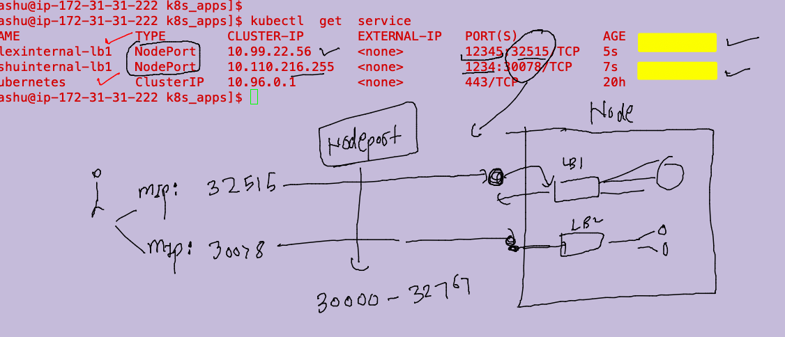

# mobileum_cna_may162022

## Session Plan :-  


### day4 related questions 

### example of compsoe 

```
ashu@ip-172-31-31-222 ashu_scripts]$ cat multi_app.yaml 
version: '3.8' # this is compose file version
networks:
  ashubrx111:
volumes:
  ashudbvol111:
services:
 ashuapp4:
   image: mysql
   container_name: ashudbc1
   environment:
     MYSQL_ROOT_PASSWORD: "Docker@099#"
   volumes:
   -  ashudbvol111: /var/lib/mysql/
   networks:
   - ashubrx111 
 ashuapp3: # third app
  image: ashuwebapp:v0011 
  build: # building image 
   context: mobapp_demo # location of dockerfile
  container_name: ashuc3
  ports:
  - 9900:80
  depends_on:
  - ashuapp4 
 ashuapp2: # second app 
  image: ashuwebapp:v001
  container_name: ashuc2
  restart: always
  ports: # port forwarding 
  - 1234:80 
 ashuapp1: # name of app
  image: alpine
  container_name: ashuc1
  command: ping localhost
  restart: always 
```
### POrtainer as docker webui Client 

```
$ docker run -itd --name webui -v /var/run/docker.sock:/var/run/docker.sock -p 9000:9000  portainer/portainer 
```

### k8s arch 


### k8s apiserver as number of api version exposed with resources 


### list of api resources 

```
kubectl  api-resources
```

## Getting started with Pods 

### POD1 example 

```

```

### Deploy pod 

```
 kubectl create  -f  ashupod1.yaml 
pod/ashupod-007 created
[ashu@ip-172-31-31-222 k8s_apps]$ kubectl get  pods
NAME          READY   STATUS    RESTARTS   AGE
alexpod-007   1/1     Running   0          2s
ashupod-007   1/1     Running   0          4s
mattalp       1/1     Running   0          7s
```

### troubleshoot 

```
 kubectl describe  pod  davewpod-007
Name:         davewpod-007
Namespace:    default
Priority:     0
Node:         minion1/172.31.83.4
Start Time:   Fri, 20 May 2022 08:43:48 +0000
Labels:       <none>
Annotations:  cni.projectcalico.org/containerID: 04d2e35866bb86be4efbdabe6eb87465f6c6430fe7c5322bde6e6f2337192d47
              cni.projectcalico.org/podIP: 192.168.34.17/32
              cni.projectcalico.org/podIPs: 192.168.34
```

### remove a pod 

```
kubectl  delete pod deepapod1
pod "deepapod1" deleted

```

### container shell 

```
 kubectl   exec -it   ashupod-007  -- bash 
root@ashupod-007:/# 
root@ashupod-007:/# 
root@ashupod-007:/# 
root@ashupod-007:/# ls
bin   dev		   docker-entrypoint.sh  home  lib64  mnt  proc  run   srv  tmp  var
boot  docker-entrypoint.d  etc			 lib   media  opt  root  sbin  sys  usr
root@ashupod-007:/# exit
exit

```

### checking logs 

```
kubectl  logs ashupod-007
/docker-entrypoint.sh: /docker-entrypoint.d/ is not empty, will attempt to perform configuration
/docker-entrypoint.sh: Looking for shell scripts in /docker-entrypoint.d/
/docker-entrypoint.sh: Launching /docker-entrypoint.d/10-listen-on-ipv6-by-default.sh
10-listen-on-ipv6-by-default.sh: info: Getting the checksum of /etc/nginx/conf.d/default.conf
10-listen-on-ipv6-by-default.sh: info: Enabled listen on IPv6 in /etc/nginx/conf.d/default.conf
/docker-entrypoint.sh: Launching /docker-entrypoint.d/20-envsubst-on-templates.sh
/docker-entrypoint.sh: Launching /docker-entrypoint.d/30-tune-worker-processes.sh
/docker-entrypoint.sh: Configuration complete; ready for start up
2022/05/20 08:43:43 [notice] 1#1: using the "epoll" event method
```

### delete pods 

```
 kubectl  delete pods --all
pod "alexpod-007" deleted
pod "arpitapod-001" deleted
pod "ashupod-007" deleted
pod "davewpod-007" deleted
pod "davidpod-001" deleted

```

### AUto generate YAML / JSON file 

```
kubectl  run ashupod1  --image=nginx  --port 80 --dry-run=client -o yaml 
apiVersion: v1
kind: Pod
metadata:
  creationTimestamp: null
  labels:
    run: ashupod1
  name: ashupod1
spec:
  containers:

```

### testing file 

```
 kubectl  create  -f  auto.yaml 
pod/ashupod1 created
[ashu@ip-172-31-31-222 k8s_apps]$ kubectl  get pods
NAME           READY   STATUS      RESTARTS      AGE
alexpod1       1/1     Running     0             91s
arpitapod1     1/1     Running     0             99s
ashupod1       1/1     Running     0             4s
mallapp        0/1     Completed   4 (47s ago)   95s
sanjayap-007   1/1     Running     0             21m
[ashu@ip-172-31-31-222 k8s_apps]$ kubectl delete -f  auto.yaml 
pod "ashupod1" deleted

```

### creating pod from cli 

```
kubectl  run ashupod1  --image=nginx  --port 80 
pod/ashupod1 created
[ashu@ip-172-31-31-222 k8s_apps]$ 
[ashu@ip-172-31-31-222 k8s_apps]$ 
[ashu@ip-172-31-31-222 k8s_apps]$ kubectl   get po
NAME           READY   STATUS             RESTARTS      AGE
arpitapod1     1/1     Running            0             3m21s
ashupod1       1/1     Running            0             5s
mallapp        0/1     CrashLoopBackOff   5 (16s ago)   3m17s
malliapp       0/1     CrashLoopBackOff   3 (28s ago)   68s
nikospod1      1/1     Running            0             100s
pradeep-007    1/1     Running            0             33s
sanjayap-007   1/1     Running            0             23m
[ashu@ip-172-31-31-222 k8s_apps]$ kubectl  delete pod ashupod1
pod "ashupod1" deleted

```
### task 

```
[ashu@ip-172-31-31-222 k8s_apps]$ cat  task1.yaml 
apiVersion: v1
kind: Pod
metadata:
  creationTimestamp: null
  labels:
    run: ashutoshhpod1
  name: ashutoshhpod1
spec:
  containers:
  - image: busybox
    name: ashutoshhpod1
    command: ["sh","-c","ping fb.com"] # to replace default process in k8s 
    resources: {}
  dnsPolicy: ClusterFirst
  restartPolicy: Always
```

### supply command option using cli 

```
 kubectl run pod1 --image=busybox --command ping fb.com  --dry-run=client -oyaml
```


## networking in k8s 

### POd Networking. with CNI 

### CNI bridge using any cni Plugin


### to access app locally from K8s client system 

```
 kubectl  get po  ashuwebpod1  -o wide
NAME          READY   STATUS    RESTARTS   AGE     IP                NODE      NOMINATED NODE   READINESS GATES
ashuwebpod1   1/1     Running   0          2m17s   192.168.179.200   minion2   <none>           <none>
[ashu@ip-172-31-31-222 k8s_apps]$ curl http://192.168.179.200
^C
[ashu@ip-172-31-31-222 k8s_apps]$ kubectl port-forward  ashuwebpod1  1122:80 
Forwarding from 127.0.0.1:1122 -> 80
Forwarding from [::1]:1122 -> 80
Handling connection for 1122
Handling connection for 1122
^C[ashu@ip-172-31-31-222 k8s_apps]$ 
[ashu@ip-172-31-31-222 k8s_apps]$ 
[ashu@ip-172-31-31-222 k8s_apps]$ 
[ashu@ip-172-31-31-222 k8s_apps]$ 


```
# TO access app from public / end user we are introducing Internal Load Balancer 


### Service Resource and its category 


### creating service 

```
kubectl create  service  
Create a service using a specified subcommand.

Aliases:
service, svc

Available Commands:
  clusterip      Create a ClusterIP service
  externalname   Create an ExternalName service
  loadbalancer   Create a LoadBalancer service
  nodeport       Create a NodePort service
```


### NodePOrt service 

```
kubectl create  service  nodeport  ashuinternal_lb1  --tcp 1234:80  --dry-run=client -o    yaml   >nodeportsvc.yaml 
```

### Understanding 


### more details




### k8s internal LB will find relevant pod using POd labels 

### lets check labels of pod 

```
$ kubectl get po  ashuwebpod1  --show-labels
NAME          READY   STATUS    RESTARTS   AGE    LABELS
ashuwebpod1   1/1     Running   0          139m   run=ashuwebpod1

```

### configuring service selector to find pod 

```
[ashu@ip-172-31-31-222 k8s_apps]$ kubectl get po  ashuwebpod1  --show-labels
NAME          READY   STATUS    RESTARTS   AGE    LABELS
ashuwebpod1   1/1     Running   0          142m   run=ashuwebpod1
[ashu@ip-172-31-31-222 k8s_apps]$ cat nodeportsvc.yaml 
apiVersion: v1
kind: Service
metadata:
  creationTimestamp: null
  labels:
    app: ashuinternal-lb1
  name: ashuinternal-lb1
spec:
  ports:
  - name: 1234-80
    port: 1234
    protocol: TCP
    targetPort: 80
  selector: # pod finder field 
    run: ashuwebpod1 # label of pod to find 
  type: NodePort
status:
  loadBalancer: {}
[ashu@ip-172-31-31-222 k8s_apps]$ kubectl  replace -f nodeportsvc.yaml  --force 
service "ashuinternal-lb1" deleted
service/ashuinternal-lb1 replaced
[ashu@ip-172-31-31-222 k8s_apps]$ kubectl  get svc  ashuinternal-lb1 -o wide
NAME               TYPE       CLUSTER-IP      EXTERNAL-IP   PORT(S)          AGE   SELECTOR
ashuinternal-lb1   NodePort   10.102.130.81   <none>        1234:32128/TCP   23s   run=ashuwebpod1
```

### External LB and DNS INtro 


### loadbalancer svc with k8s cluster deployment methods 


```
 kubectl  expose pod alexwebpod2 --type LoadBalancer --port 80 --name alexlb2
service/alexlb2 exposed
[ashu@ip-172-31-31-222 ~]$ kubectl get svc |  grep -i ale
alexinternal-lb1      NodePort       10.107.188.142   <none>        12345:30764/TCP   33m
alexlb2               LoadBalancer   10.104.217.109   <pending>     80:31907/TCP      9s
[ashu@ip-172-31-31-222 ~]$ kubectl get svc |  grep -i ale

```

## Namespace in ks8 

```
[ashu@ip-172-31-31-222 ~]$ kubectl  get  ns
NAME              STATUS   AGE
default           Active   2d11h
kube-node-lease   Active   2d11h
kube-public       Active   2d11h
kube-system       Active   2d11h
[ashu@ip-172-31-31-222 ~]$ kubectl create  namespace  ashu-project 
namespace/ashu-project created
[ashu@ip-172-31-31-222 ~]$ kubectl  get  ns
NAME              STATUS   AGE
ashu-project      Active   2s
default           Active   2d11h
kube-node-lease   Active   2d11h
kube-public       Active   2d11h
kube-system       Active   2d11h
```

### creating namespace in setting it as default 

```
[ashu@ip-172-31-31-222 ~]$ kubectl   get  pods
No resources found in default namespace.
[ashu@ip-172-31-31-222 ~]$ 
[ashu@ip-172-31-31-222 ~]$ 
[ashu@ip-172-31-31-222 ~]$ kubectl  config set-context --current --namespace ashu-project
Context "kubernetes-admin@kubernetes" modified.
[ashu@ip-172-31-31-222 ~]$ 
[ashu@ip-172-31-31-222 ~]$ kubectl   get  pods
No resources found in ashu-project namespace.
```

### 

```
 cd  k8s_apps/
[ashu@ip-172-31-31-222 k8s_apps]$ ls
ashupod1.yaml  auto.yaml  customerpod.yaml  logs.txt  nodeportsvc.yaml  pod1.yaml  task1.yaml
[ashu@ip-172-31-31-222 k8s_apps]$ 
[ashu@ip-172-31-31-222 k8s_apps]$ 
[ashu@ip-172-31-31-222 k8s_apps]$ kubectl  create  -f  customerpod.yaml  -f  nodeportsvc.yaml  
pod/ashuwebpod1 created
service/ashuinternal-lb1 created
[ashu@ip-172-31-31-222 k8s_apps]$ kubectl   get  pod,svc
NAME              READY   STATUS    RESTARTS   AGE
pod/ashuwebpod1   1/1     Running   0          7s

NAME                       TYPE       CLUSTER-IP      EXTERNAL-IP   PORT(S)          AGE
service/ashuinternal-lb1   NodePort   10.103.145.13   <none>        1234:30722/TCP   7s
[ashu@ip-172-31-31-222 k8s_apps]$ 


```


